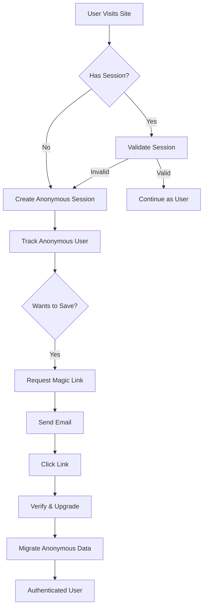

# Authentication System Implementation Plan

## Executive Summary

This document provides a comprehensive implementation plan for GitHub issue #5: building a complete authentication system using Supabase Auth with support for anonymous users, magic link authentication, and seamless user upgrade flows.

## Table of Contents

1. [Architecture Overview](#architecture-overview)
2. [Database Schema](#database-schema)
3. [Implementation Tasks](#implementation-tasks)
4. [Security Considerations](#security-considerations)
5. [Testing Strategy](#testing-strategy)
6. [Rollback Plan](#rollback-plan)

## Architecture Overview

### Core Design Principles

1. **Anonymous-First**: Users can start creating without signup
2. **Progressive Enhancement**: Anonymous users can upgrade to authenticated accounts
3. **Server-Side Auth**: All authentication logic runs in API routes
4. **Secure Session Management**: HTTP-only cookies with refresh token rotation
5. **Rate Limiting**: Prevent abuse and brute force attacks

### Authentication Flow



### Session Architecture

- **Anonymous Sessions**: Tracked via browser fingerprint + secure token
- **Authenticated Sessions**: Supabase Auth with JWT tokens
- **Session Storage**: HTTP-only cookies with SameSite=Strict
- **Refresh Strategy**: Automatic token refresh before expiry

## Database Schema

### New Tables Required

```sql
-- User profiles extension (extends existing users table)
ALTER TABLE users ADD COLUMN IF NOT EXISTS
    anonymous_id UUID UNIQUE,
    anonymous_created_at TIMESTAMPTZ,
    upgraded_from_anonymous_at TIMESTAMPTZ,
    last_sign_in_at TIMESTAMPTZ,
    sign_in_count INTEGER DEFAULT 0,
    email_verified_at TIMESTAMPTZ;

-- Create index for anonymous lookups
CREATE INDEX IF NOT EXISTS idx_users_anonymous_id ON users(anonymous_id);

-- Authentication logs for audit trail
CREATE TABLE IF NOT EXISTS auth_logs (
    id UUID PRIMARY KEY DEFAULT uuid_generate_v4(),
    user_id UUID REFERENCES users(id) ON DELETE CASCADE,
    anonymous_id UUID,
    event_type VARCHAR(50) NOT NULL, -- 'login', 'logout', 'magic_link_sent', 'magic_link_used', 'session_refresh', 'upgrade_from_anonymous'
    ip_address INET,
    user_agent TEXT,
    metadata JSONB DEFAULT '{}',
    created_at TIMESTAMPTZ DEFAULT NOW() NOT NULL
);

-- Create indexes for auth logs
CREATE INDEX idx_auth_logs_user_id ON auth_logs(user_id);
CREATE INDEX idx_auth_logs_anonymous_id ON auth_logs(anonymous_id);
CREATE INDEX idx_auth_logs_event_type ON auth_logs(event_type);
CREATE INDEX idx_auth_logs_created_at ON auth_logs(created_at DESC);

-- Rate limiting table
CREATE TABLE IF NOT EXISTS rate_limits (
    identifier VARCHAR(255) PRIMARY KEY, -- email or IP address
    action VARCHAR(50) NOT NULL, -- 'magic_link', 'login_attempt', etc.
    attempts INTEGER DEFAULT 1,
    window_start TIMESTAMPTZ DEFAULT NOW(),
    blocked_until TIMESTAMPTZ,
    UNIQUE(identifier, action)
);

-- Create index for rate limit checks
CREATE INDEX idx_rate_limits_identifier ON rate_limits(identifier);
CREATE INDEX idx_rate_limits_blocked_until ON rate_limits(blocked_until);

-- Anonymous sessions tracking
CREATE TABLE IF NOT EXISTS anonymous_sessions (
    id UUID PRIMARY KEY DEFAULT uuid_generate_v4(),
    session_token VARCHAR(255) NOT NULL UNIQUE,
    fingerprint VARCHAR(255),
    user_agent TEXT,
    ip_address INET,
    created_at TIMESTAMPTZ DEFAULT NOW() NOT NULL,
    last_activity_at TIMESTAMPTZ DEFAULT NOW() NOT NULL,
    upgraded_to_user_id UUID REFERENCES users(id) ON DELETE SET NULL
);

-- Create indexes for session lookups
CREATE INDEX idx_anonymous_sessions_token ON anonymous_sessions(session_token);
CREATE INDEX idx_anonymous_sessions_fingerprint ON anonymous_sessions(fingerprint);
CREATE INDEX idx_anonymous_sessions_last_activity ON anonymous_sessions(last_activity_at);
```

## Implementation Tasks

### Phase 1: Foundation (Priority: Critical)

#### 1.1 Database Migration
**File**: `/Users/tom/.claude-squad/worktrees/authentication_18611668a59f3768/supabase/migrations/20240829000003_auth_system.sql`

```sql
-- Complete migration file with all tables and indexes from Database Schema section above
```

#### 1.2 Environment Configuration
**File**: `/Users/tom/.claude-squad/worktrees/authentication_18611668a59f3768/.env.example`

```bash
# Supabase Auth
SUPABASE_JWT_SECRET=your-jwt-secret-here

# Session Configuration
SESSION_SECRET=generate-32-char-random-string
SESSION_COOKIE_NAME=velro_session
SESSION_MAX_AGE=2592000 # 30 days in seconds
ANONYMOUS_SESSION_MAX_AGE=86400 # 24 hours in seconds

# Magic Link Configuration
MAGIC_LINK_REDIRECT_URL=http://localhost:3000/api/v1/auth/verify
MAGIC_LINK_EXPIRY=3600 # 1 hour in seconds

# Rate Limiting
RATE_LIMIT_MAGIC_LINK_PER_HOUR=3
RATE_LIMIT_LOGIN_ATTEMPTS_PER_HOUR=10

# Security
BCRYPT_ROUNDS=10
CORS_ALLOWED_ORIGINS=http://localhost:3000
```

#### 1.3 Auth Service Core
**File**: `/Users/tom/.claude-squad/worktrees/authentication_18611668a59f3768/src/lib/auth/service.ts`

```typescript
import { createServerClient } from '@/lib/supabase/server';
import { createBrowserClient } from '@/lib/supabase/client';
import { cookies } from 'next/headers';
import { VelroError } from '@/lib/errors';
import type { User, AuthLog } from '@/types/database';
import { nanoid } from 'nanoid';
import crypto from 'crypto';

export class AuthService {
  private supabase = createServerClient();

  /**
   * Create anonymous session
   */
  async createAnonymousSession(fingerprint?: string): Promise<{
    sessionToken: string;
    anonymousId: string;
  }> {
    const sessionToken = nanoid(32);
    const anonymousId = crypto.randomUUID();
    
    // Store in database
    const { data, error } = await this.supabase
      .from('anonymous_sessions')
      .insert({
        session_token: sessionToken,
        fingerprint,
        user_agent: headers().get('user-agent'),
        ip_address: headers().get('x-forwarded-for')?.split(',')[0],
      })
      .select()
      .single();

    if (error) throw new DatabaseError('Failed to create anonymous session', { error });
    
    // Set HTTP-only cookie
    cookies().set({
      name: process.env.SESSION_COOKIE_NAME!,
      value: sessionToken,
      httpOnly: true,
      secure: process.env.NODE_ENV === 'production',
      sameSite: 'strict',
      maxAge: parseInt(process.env.ANONYMOUS_SESSION_MAX_AGE!),
      path: '/',
    });

    return { sessionToken, anonymousId: data.id };
  }

  /**
   * Send magic link
   */
  async sendMagicLink(email: string): Promise<void> {
    // Check rate limits
    await this.checkRateLimit(email, 'magic_link');
    
    // Generate OTP via Supabase
    const { error } = await this.supabase.auth.signInWithOtp({
      email,
      options: {
        emailRedirectTo: process.env.MAGIC_LINK_REDIRECT_URL,
      },
    });

    if (error) throw new VelroError('Failed to send magic link', 'AUTH_MAGIC_LINK_FAILED', 500, { error });
    
    // Log the event
    await this.logAuthEvent(null, 'magic_link_sent', { email });
  }

  /**
   * Verify magic link and upgrade anonymous user
   */
  async verifyMagicLink(token: string, anonymousSessionToken?: string): Promise<User> {
    // Verify token with Supabase
    const { data: { user }, error } = await this.supabase.auth.verifyOtp({
      token_hash: token,
      type: 'email',
    });

    if (error || !user) {
      throw new VelroError('Invalid or expired magic link', 'AUTH_INVALID_TOKEN', 401);
    }

    // Create or update user profile
    let dbUser = await this.findOrCreateUser(user.email!, user.id);

    // If anonymous session exists, migrate data
    if (anonymousSessionToken) {
      await this.upgradeAnonymousUser(anonymousSessionToken, dbUser.id);
    }

    // Log successful authentication
    await this.logAuthEvent(dbUser.id, 'magic_link_used');

    return dbUser;
  }

  /**
   * Check rate limits
   */
  private async checkRateLimit(identifier: string, action: string): Promise<void> {
    const { data: limit } = await this.supabase
      .from('rate_limits')
      .select()
      .eq('identifier', identifier)
      .eq('action', action)
      .single();

    if (limit?.blocked_until && new Date(limit.blocked_until) > new Date()) {
      throw new VelroError('Too many attempts. Please try again later.', 'RATE_LIMIT_EXCEEDED', 429);
    }

    // Update or create rate limit record
    // Implementation details...
  }

  /**
   * Log authentication events
   */
  private async logAuthEvent(
    userId: string | null,
    eventType: string,
    metadata?: Record<string, unknown>
  ): Promise<void> {
    await this.supabase.from('auth_logs').insert({
      user_id: userId,
      event_type: eventType,
      ip_address: headers().get('x-forwarded-for')?.split(',')[0],
      user_agent: headers().get('user-agent'),
      metadata,
    });
  }
}
```

### Phase 2: API Endpoints (Priority: High)

#### 2.1 Anonymous Session Creation
**File**: `/Users/tom/.claude-squad/worktrees/authentication_18611668a59f3768/src/app/api/v1/auth/anonymous/route.ts`

```typescript
import { NextRequest, NextResponse } from 'next/server';
import { AuthService } from '@/lib/auth/service';
import { handleApiError } from '@/lib/errors';
import { z } from 'zod';

const requestSchema = z.object({
  fingerprint: z.string().optional(),
});

export async function POST(request: NextRequest) {
  try {
    const body = await request.json();
    const { fingerprint } = requestSchema.parse(body);
    
    const authService = new AuthService();
    const session = await authService.createAnonymousSession(fingerprint);
    
    return NextResponse.json({
      success: true,
      anonymousId: session.anonymousId,
      message: 'Anonymous session created',
    }, { status: 201 });
  } catch (error) {
    const handledError = handleApiError(error);
    return NextResponse.json(
      { success: false, error: handledError.toJSON() },
      { status: handledError.statusCode }
    );
  }
}
```

#### 2.2 Magic Link Request
**File**: `/Users/tom/.claude-squad/worktrees/authentication_18611668a59f3768/src/app/api/v1/auth/magic-link/route.ts`

```typescript
import { NextRequest, NextResponse } from 'next/server';
import { AuthService } from '@/lib/auth/service';
import { handleApiError, ValidationError } from '@/lib/errors';
import { z } from 'zod';

const requestSchema = z.object({
  email: z.string().email(),
  redirectTo: z.string().url().optional(),
});

export async function POST(request: NextRequest) {
  try {
    const body = await request.json();
    const { email } = requestSchema.parse(body);
    
    const authService = new AuthService();
    await authService.sendMagicLink(email);
    
    return NextResponse.json({
      success: true,
      message: 'Magic link sent to your email',
    });
  } catch (error) {
    const handledError = handleApiError(error);
    return NextResponse.json(
      { success: false, error: handledError.toJSON() },
      { status: handledError.statusCode }
    );
  }
}
```

#### 2.3 Magic Link Verification
**File**: `/Users/tom/.claude-squad/worktrees/authentication_18611668a59f3768/src/app/api/v1/auth/verify/route.ts`

```typescript
import { NextRequest, NextResponse } from 'next/server';
import { AuthService } from '@/lib/auth/service';
import { handleApiError } from '@/lib/errors';
import { cookies } from 'next/headers';

export async function GET(request: NextRequest) {
  try {
    const token = request.nextUrl.searchParams.get('token');
    if (!token) {
      throw new ValidationError('Missing verification token');
    }

    const anonymousToken = cookies().get(process.env.SESSION_COOKIE_NAME!)?.value;
    
    const authService = new AuthService();
    const user = await authService.verifyMagicLink(token, anonymousToken);
    
    // Redirect to dashboard or success page
    return NextResponse.redirect(new URL('/dashboard', request.url));
  } catch (error) {
    const handledError = handleApiError(error);
    // Redirect to error page with error details
    return NextResponse.redirect(
      new URL(`/auth/error?code=${handledError.code}`, request.url)
    );
  }
}
```

#### 2.4 Session Check
**File**: `/Users/tom/.claude-squad/worktrees/authentication_18611668a59f3768/src/app/api/v1/auth/session/route.ts`

```typescript
import { NextRequest, NextResponse } from 'next/server';
import { AuthService } from '@/lib/auth/service';
import { handleApiError } from '@/lib/errors';

export async function GET(request: NextRequest) {
  try {
    const authService = new AuthService();
    const session = await authService.getCurrentSession();
    
    return NextResponse.json({
      success: true,
      isAuthenticated: !!session.user,
      user: session.user,
      isAnonymous: session.isAnonymous,
    });
  } catch (error) {
    const handledError = handleApiError(error);
    return NextResponse.json(
      { success: false, error: handledError.toJSON() },
      { status: handledError.statusCode }
    );
  }
}
```

#### 2.5 Logout
**File**: `/Users/tom/.claude-squad/worktrees/authentication_18611668a59f3768/src/app/api/v1/auth/logout/route.ts`

```typescript
import { NextRequest, NextResponse } from 'next/server';
import { AuthService } from '@/lib/auth/service';
import { cookies } from 'next/headers';

export async function POST(request: NextRequest) {
  try {
    const authService = new AuthService();
    await authService.logout();
    
    // Clear session cookie
    cookies().delete(process.env.SESSION_COOKIE_NAME!);
    
    return NextResponse.json({
      success: true,
      message: 'Logged out successfully',
    });
  } catch (error) {
    const handledError = handleApiError(error);
    return NextResponse.json(
      { success: false, error: handledError.toJSON() },
      { status: handledError.statusCode }
    );
  }
}
```

#### 2.6 Session Refresh
**File**: `/Users/tom/.claude-squad/worktrees/authentication_18611668a59f3768/src/app/api/v1/auth/refresh/route.ts`

```typescript
import { NextRequest, NextResponse } from 'next/server';
import { AuthService } from '@/lib/auth/service';
import { handleApiError } from '@/lib/errors';

export async function POST(request: NextRequest) {
  try {
    const authService = new AuthService();
    const session = await authService.refreshSession();
    
    return NextResponse.json({
      success: true,
      session,
      message: 'Session refreshed successfully',
    });
  } catch (error) {
    const handledError = handleApiError(error);
    return NextResponse.json(
      { success: false, error: handledError.toJSON() },
      { status: handledError.statusCode }
    );
  }
}
```

### Phase 3: Middleware & Guards (Priority: High)

#### 3.1 Auth Middleware
**File**: `/Users/tom/.claude-squad/worktrees/authentication_18611668a59f3768/src/lib/auth/middleware.ts`

```typescript
import { NextRequest, NextResponse } from 'next/server';
import { AuthService } from './service';
import { VelroError } from '@/lib/errors';

export interface AuthenticatedRequest extends NextRequest {
  user?: User;
  isAnonymous?: boolean;
  sessionId?: string;
}

/**
 * Middleware to verify authentication
 */
export async function withAuth(
  handler: (request: AuthenticatedRequest) => Promise<NextResponse>,
  options?: {
    requireAuth?: boolean;
    allowAnonymous?: boolean;
  }
) {
  return async (request: NextRequest): Promise<NextResponse> => {
    try {
      const authService = new AuthService();
      const session = await authService.getCurrentSession();
      
      // Check if authentication is required
      if (options?.requireAuth && !session.user) {
        throw new VelroError('Authentication required', 'AUTH_REQUIRED', 401);
      }
      
      // Check if anonymous access is allowed
      if (!options?.allowAnonymous && session.isAnonymous) {
        throw new VelroError('Anonymous access not allowed', 'ANONYMOUS_NOT_ALLOWED', 403);
      }
      
      // Enhance request with auth data
      const authenticatedRequest = request as AuthenticatedRequest;
      authenticatedRequest.user = session.user;
      authenticatedRequest.isAnonymous = session.isAnonymous;
      authenticatedRequest.sessionId = session.sessionId;
      
      return await handler(authenticatedRequest);
    } catch (error) {
      if (error instanceof VelroError) {
        return NextResponse.json(
          { success: false, error: error.toJSON() },
          { status: error.statusCode }
        );
      }
      throw error;
    }
  };
}

/**
 * Middleware to check team membership
 */
export async function withTeamAccess(
  handler: (request: AuthenticatedRequest) => Promise<NextResponse>,
  requiredRole?: TeamMemberRole
) {
  return withAuth(async (request: AuthenticatedRequest) => {
    const teamId = request.headers.get('x-team-id') || 
                   request.nextUrl.searchParams.get('teamId');
    
    if (!teamId) {
      throw new VelroError('Team ID required', 'TEAM_ID_REQUIRED', 400);
    }
    
    const authService = new AuthService();
    const hasAccess = await authService.checkTeamAccess(
      request.user!.id,
      teamId,
      requiredRole
    );
    
    if (!hasAccess) {
      throw new VelroError('Insufficient team permissions', 'TEAM_ACCESS_DENIED', 403);
    }
    
    return await handler(request);
  }, { requireAuth: true });
}
```

### Phase 4: Client Utilities (Priority: Medium)

#### 4.1 Auth Hook
**File**: `/Users/tom/.claude-squad/worktrees/authentication_18611668a59f3768/src/lib/auth/hooks.ts`

```typescript
import { useQuery, useMutation, useQueryClient } from '@tanstack/react-query';
import type { User } from '@/types/database';

interface AuthSession {
  isAuthenticated: boolean;
  user?: User;
  isAnonymous: boolean;
}

export function useAuth() {
  const queryClient = useQueryClient();
  
  const { data: session, isLoading } = useQuery<AuthSession>({
    queryKey: ['auth', 'session'],
    queryFn: async () => {
      const res = await fetch('/api/v1/auth/session');
      if (!res.ok) throw new Error('Failed to fetch session');
      const data = await res.json();
      return data;
    },
    staleTime: 5 * 60 * 1000, // 5 minutes
  });
  
  const loginMutation = useMutation({
    mutationFn: async (email: string) => {
      const res = await fetch('/api/v1/auth/magic-link', {
        method: 'POST',
        headers: { 'Content-Type': 'application/json' },
        body: JSON.stringify({ email }),
      });
      if (!res.ok) throw new Error('Failed to send magic link');
      return res.json();
    },
    onSuccess: () => {
      // Show success message
    },
  });
  
  const logoutMutation = useMutation({
    mutationFn: async () => {
      const res = await fetch('/api/v1/auth/logout', {
        method: 'POST',
      });
      if (!res.ok) throw new Error('Failed to logout');
      return res.json();
    },
    onSuccess: () => {
      queryClient.invalidateQueries({ queryKey: ['auth'] });
    },
  });
  
  return {
    session,
    isLoading,
    isAuthenticated: session?.isAuthenticated ?? false,
    user: session?.user,
    isAnonymous: session?.isAnonymous ?? true,
    login: loginMutation.mutate,
    logout: logoutMutation.mutate,
  };
}
```

### Phase 5: Testing (Priority: Critical)

#### 5.1 Auth Service Tests
**File**: `/Users/tom/.claude-squad/worktrees/authentication_18611668a59f3768/src/lib/auth/service.test.ts`

```typescript
import { describe, it, expect, beforeEach, vi } from 'vitest';
import { AuthService } from './service';
import { createServerClient } from '@/lib/supabase/server';

vi.mock('@/lib/supabase/server');

describe('AuthService', () => {
  let authService: AuthService;
  
  beforeEach(() => {
    authService = new AuthService();
  });
  
  describe('createAnonymousSession', () => {
    it('should create anonymous session with token', async () => {
      const session = await authService.createAnonymousSession();
      expect(session.sessionToken).toBeDefined();
      expect(session.anonymousId).toBeDefined();
    });
    
    it('should set HTTP-only cookie', async () => {
      // Test cookie setting
    });
  });
  
  describe('sendMagicLink', () => {
    it('should send magic link to valid email', async () => {
      await expect(authService.sendMagicLink('test@example.com')).resolves.not.toThrow();
    });
    
    it('should enforce rate limits', async () => {
      // Test rate limiting
    });
  });
  
  describe('verifyMagicLink', () => {
    it('should verify valid token and create user', async () => {
      // Test token verification
    });
    
    it('should upgrade anonymous user', async () => {
      // Test anonymous upgrade
    });
  });
});
```

#### 5.2 API Endpoint Tests
**File**: `/Users/tom/.claude-squad/worktrees/authentication_18611668a59f3768/src/app/api/v1/auth/magic-link/route.test.ts`

```typescript
import { describe, it, expect } from 'vitest';
import { POST } from './route';
import { NextRequest } from 'next/server';

describe('POST /api/v1/auth/magic-link', () => {
  it('should send magic link for valid email', async () => {
    const request = new NextRequest('http://localhost/api/v1/auth/magic-link', {
      method: 'POST',
      body: JSON.stringify({ email: 'test@example.com' }),
    });
    
    const response = await POST(request);
    const data = await response.json();
    
    expect(response.status).toBe(200);
    expect(data.success).toBe(true);
  });
  
  it('should reject invalid email', async () => {
    const request = new NextRequest('http://localhost/api/v1/auth/magic-link', {
      method: 'POST',
      body: JSON.stringify({ email: 'invalid-email' }),
    });
    
    const response = await POST(request);
    expect(response.status).toBe(400);
  });
});
```

## Security Considerations

### 1. Session Security
- **HTTP-Only Cookies**: Prevent XSS attacks
- **SameSite=Strict**: Prevent CSRF attacks
- **Secure Flag**: HTTPS only in production
- **Token Rotation**: Refresh tokens before expiry

### 2. Rate Limiting
- **Magic Links**: 3 per hour per email
- **Login Attempts**: 10 per hour per IP
- **Session Creation**: 20 per hour per IP
- **Exponential Backoff**: Increase delay on repeated failures

### 3. Input Validation
- **Email Validation**: RFC 5322 compliant
- **Token Validation**: Cryptographically secure tokens
- **SQL Injection Prevention**: Parameterized queries via Supabase
- **XSS Prevention**: Sanitize all user inputs

### 4. Audit Logging
- Log all authentication events
- Track IP addresses and user agents
- Monitor for suspicious patterns
- Alert on anomalies

### 5. Data Protection
- **Encryption at Rest**: Supabase handles database encryption
- **Encryption in Transit**: HTTPS everywhere
- **PII Handling**: Minimize personal data storage
- **GDPR Compliance**: Right to deletion, data portability

## Testing Strategy

### Unit Tests
1. Auth Service methods
2. Rate limiting logic
3. Token generation and validation
4. Session management

### Integration Tests
1. Complete auth flows
2. Anonymous to authenticated upgrade
3. Magic link verification
4. Session refresh

### Security Tests
1. Rate limit enforcement
2. SQL injection attempts
3. XSS prevention
4. CSRF protection

### Performance Tests
1. Session lookup speed
2. Database query optimization
3. Rate limit check performance
4. Concurrent user handling

## Rollback Plan

### Preparation
1. **Database Backup**: Full backup before deployment
2. **Feature Flag**: Add kill switch for new auth system
3. **Monitoring**: Set up alerts for auth failures
4. **Staging Test**: Complete test in staging environment

### Rollback Steps
1. **Immediate**: Disable feature flag
2. **Database**: Revert migration if needed
3. **Code**: Deploy previous version
4. **Cache**: Clear all auth-related caches
5. **Monitoring**: Verify system stability

### Recovery Validation
1. Check authentication works
2. Verify no data loss
3. Confirm session integrity
4. Test all auth endpoints

## Implementation Timeline

### Week 1: Foundation
- Day 1-2: Database migrations and schema
- Day 3-4: Core auth service implementation
- Day 5: Basic API endpoints

### Week 2: Features
- Day 1-2: Anonymous session management
- Day 3-4: Magic link flow
- Day 5: Session refresh and upgrade

### Week 3: Security & Testing
- Day 1-2: Rate limiting implementation
- Day 3-4: Security hardening
- Day 5: Comprehensive testing

### Week 4: Polish & Deploy
- Day 1-2: Performance optimization
- Day 3: Staging deployment
- Day 4: Production deployment
- Day 5: Monitoring and adjustments

## Success Metrics

1. **Authentication Success Rate**: > 95%
2. **Magic Link Delivery**: < 30 seconds
3. **Session Creation Time**: < 100ms
4. **Anonymous Upgrade Rate**: > 20%
5. **Zero Security Incidents**: No breaches

## Appendix

### Environment Variables Checklist
- [ ] SUPABASE_JWT_SECRET
- [ ] SESSION_SECRET
- [ ] SESSION_COOKIE_NAME
- [ ] MAGIC_LINK_REDIRECT_URL
- [ ] Rate limit configurations

### Dependencies to Add
```json
{
  "dependencies": {
    "nanoid": "^5.0.0",
    "@tanstack/react-query": "^5.0.0"
  }
}
```

### Migration Checklist
- [ ] Backup production database
- [ ] Test migrations locally
- [ ] Test in staging environment
- [ ] Prepare rollback script
- [ ] Schedule maintenance window

## References

- [Supabase Auth Documentation](https://supabase.com/docs/guides/auth)
- [OWASP Authentication Cheat Sheet](https://cheatsheetseries.owasp.org/cheatsheets/Authentication_Cheat_Sheet.html)
- [Next.js Authentication Patterns](https://nextjs.org/docs/authentication)