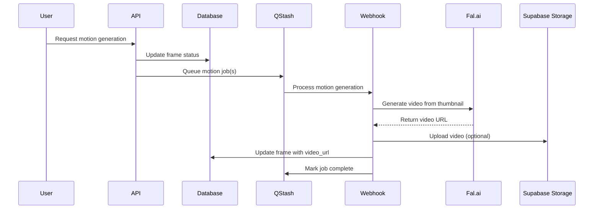

# Motion Generation Feature Implementation Plan

## Executive Summary

Extend the existing frame generation system to support motion/video generation using Fal.ai's video models. This feature builds upon the existing thumbnail generation functionality by adding the capability to transform static frames into dynamic video sequences.

## Current Architecture Analysis

### Existing Components

1. **Frame System**:
   - Database schema supports `video_url` field alongside `thumbnail_url`
   - Frame generation creates descriptions and static thumbnails
   - Two-phase generation: Quick frame creation + async image generation

2. **Fal.ai Integration**:
   - Client already supports both image AND video generation
   - Multiple video models available (text-to-video, image-to-video)
   - Existing mock responses for testing

3. **QStash Pipeline**:
   - Image generation webhook fully implemented
   - Video generation webhook exists but not connected to frames
   - Job management system tracks all async operations

4. **Storage Infrastructure**:
   - Supabase Storage bucket for videos (500MB limit)
   - Public read access, authenticated write
   - Proper RLS policies in place

## Implementation Design

### Motion Generation Workflow



### Technical Architecture

#### 1. Motion Generation Strategy

- **Primary Approach**: Image-to-Video (I2V) using existing thumbnails
- **Input**: Frame's `thumbnail_url` + enhanced motion prompt
- **Output**: MP4 video stored in Supabase Storage
- **Duration**: 3-5 seconds per frame (configurable)

#### 2. Model Selection

```typescript
// Recommended models by quality/speed tradeoff
const MOTION_MODELS = {
  fast: 'svd_lcm', // ~5s generation, good quality
  balanced: 'wan_i2v', // ~15s generation, better quality
  premium: 'kling_i2v', // ~30s generation, cinematic quality
  audio: 'veo3', // ~45s generation, includes audio
};
```

#### 3. Storage Strategy

- Store videos in Supabase Storage `videos` bucket
- Path structure: `/teams/{teamId}/sequences/{sequenceId}/frames/{frameId}/motion.mp4`
- Keep original Fal.ai URLs as backup in metadata
- Implement CDN caching for frequently accessed videos

## Implementation Tasks

### Phase 1: Backend Infrastructure (Day 1-2)

#### Task 1.1: Extend Frame Actions

**File**: `/src/app/actions/frames/index.ts`

```typescript
// Add new schemas
const generateMotionSchema = z.object({
  frameId: z.string().uuid(),
  model: z.enum(['fast', 'balanced', 'premium']).optional(),
  duration: z.number().min(1).max(10).optional(),
  motionIntensity: z.enum(['subtle', 'moderate', 'dynamic']).optional(),
});

// Add new action
export async function generateMotionAction(
  input: GenerateMotionInput
): Promise<{
  success: boolean;
  jobId?: string;
  error?: string;
}> {
  // Validate frame exists and has thumbnail
  // Create motion generation job
  // Queue to QStash
  // Return job ID for tracking
}
```

#### Task 1.2: Create Motion Generation Webhook

**File**: `/src/app/webhooks/qstash/motion/route.ts`

```typescript
// New webhook specifically for frame motion generation
// Differs from generic video webhook by:
// 1. Updating frame records directly
// 2. Using frame context for prompt enhancement
// 3. Handling batch processing for sequences
```

#### Task 1.3: Extend QStash Client

**File**: `/src/lib/qstash/client.ts`

```typescript
async publishMotionJob(
  payload: MotionGenerationPayload,
  options?: QStashOptions
): Promise<QStashResponse> {
  return this.publishMessage({
    url: `${this.baseWebhookUrl}/motion`,
    body: payload,
    delay: options?.delay,
    deduplicationId: options?.deduplicationId ?? payload.jobId,
    retries: 3,
  });
}
```

### Phase 2: Motion Generation Logic (Day 2-3)

#### Task 2.1: Motion Prompt Enhancement

**File**: `/src/lib/ai/motion-enhancer.ts`

```typescript
export async function enhanceMotionPrompt({
  frameDescription: string,
  previousFrame?: Frame,
  nextFrame?: Frame,
  styleMetadata?: Json,
  motionIntensity: 'subtle' | 'moderate' | 'dynamic'
}): Promise<string> {
  // Analyze frame context
  // Add motion directives based on scene type
  // Include camera movement suggestions
  // Maintain style consistency
}
```

#### Task 2.2: Batch Motion Generation

**File**: `/src/app/actions/frames/generate-motion-batch.ts`

```typescript
export async function generateMotionBatchAction({
  sequenceId: string,
  frameIds?: string[], // Optional: specific frames
  options: MotionOptions
}): Promise<BatchResult> {
  // Get all frames needing motion
  // Queue jobs with intelligent delays
  // Handle rate limiting
  // Return batch job tracking info
}
```

#### Task 2.3: Video Storage Service

**File**: `/src/lib/storage/video-storage.ts`

```typescript
export class VideoStorageService {
  async uploadVideo(videoUrl: string, path: string): Promise<string> {
    // Download from Fal.ai
    // Upload to Supabase Storage
    // Return public URL
  }

  async getVideoMetadata(url: string): Promise<VideoMetadata> {
    // Extract duration, dimensions, bitrate
  }
}
```

### Phase 3: Progress Tracking (Day 3-4)

#### Task 3.1: Motion Job Status

**File**: `/src/app/actions/frames/get-motion-status.ts`

```typescript
export async function getMotionJobStatus(
  jobId: string
): Promise<MotionJobStatus> {
  // Check job status
  // Calculate progress percentage
  // Return estimated time remaining
}
```

#### Task 3.2: Sequence Motion Progress

```typescript
export async function getSequenceMotionProgress(sequenceId: string): Promise<{
  totalFrames: number;
  framesWithMotion: number;
  activeJobs: number;
  estimatedCompletion?: Date;
}> {
  // Aggregate all frame motion statuses
  // Track batch progress
}
```

### Phase 4: Frontend Integration (Day 4-5)

#### Task 4.1: Motion Generation UI

**File**: `/src/components/frames/motion-generator.tsx`

```typescript
export function MotionGenerator({ frame }: { frame: Frame }) {
  // Generate Motion button
  // Model selection dropdown
  // Duration slider
  // Motion intensity selector
  // Progress indicator
}
```

#### Task 4.2: Motion Preview Component

**File**: `/src/components/frames/motion-preview.tsx`

```typescript
export function MotionPreview({ frame }: { frame: Frame }) {
  // Video player with controls
  // Fallback to thumbnail if no video
  // Download button
  // Regenerate option
}
```

#### Task 4.3: Batch Motion Controls

**File**: `/src/components/sequence/batch-motion-controls.tsx`

```typescript
export function BatchMotionControls({ sequenceId: string }) {
  // Generate All Motion button
  // Batch progress indicator
  // Cancel batch operation
  // Settings for entire sequence
}
```

### Phase 5: Testing & Optimization (Day 5-6)

#### Task 5.1: Unit Tests

```typescript
// Test files needed:
// - motion-enhancer.test.ts
// - motion-webhook.test.ts
// - video-storage.test.ts
// - batch-generation.test.ts
```

#### Task 5.2: Performance Optimization

- Implement job prioritization
- Add caching for frequently accessed videos
- Optimize video compression settings
- Implement progressive loading

#### Task 5.3: Error Handling

- Retry logic for failed generations
- Fallback to lower quality models
- User notification system
- Cleanup for orphaned videos

## API Endpoints

### New Endpoints

```typescript
// Single frame motion
POST / api / frames / { frameId } / generate - motion;
GET / api / frames / { frameId } / motion - status;

// Batch operations
POST / api / sequences / { sequenceId } / generate - all - motion;
GET / api / sequences / { sequenceId } / motion - progress;

// Motion management
DELETE / api / frames / { frameId } / motion;
POST / api / frames / { frameId } / regenerate - motion;
```

### Modified Endpoints

```typescript
// Extended to include motion data
GET / api / sequences / { sequenceId } / frames;
GET / api / frames / { frameId };
```

## Database Schema Updates

No schema changes required! Current schema already supports:

- `frames.video_url` - Store video URL
- `frames.duration_ms` - Video duration
- `frames.metadata` - Motion generation parameters

## Configuration & Environment

### Required Environment Variables

```env
# Existing (already configured)
FAL_KEY=your_fal_api_key
QSTASH_TOKEN=your_qstash_token
SUPABASE_URL=your_supabase_url
SUPABASE_ANON_KEY=your_supabase_anon_key
SUPABASE_SERVICE_ROLE_KEY=your_service_role_key

# New (optional)
MOTION_DEFAULT_MODEL=balanced
MOTION_DEFAULT_DURATION=4
MOTION_MAX_CONCURRENT_JOBS=5
```

## Cost Considerations

### Fal.ai Pricing

- Fast model (SVD-LCM): ~$0.10 per generation
- Balanced model (WAN): ~$0.25 per generation
- Premium model (Kling): ~$0.50 per generation

### Estimated Costs per Sequence

- 30 frames × $0.25 = $7.50 (balanced quality)
- 30 frames × $0.10 = $3.00 (fast quality)

### Storage Costs

- Supabase Storage: $0.021 per GB/month
- Average video: 10MB per frame
- 30 frames = 300MB per sequence

## Risk Mitigation

### Technical Risks

1. **Rate Limiting**:
   - Solution: Implement intelligent queue delays
   - Fallback: Batch processing with exponential backoff

2. **Generation Failures**:
   - Solution: Automatic retry with different models
   - Fallback: Keep static thumbnail as backup

3. **Storage Limits**:
   - Solution: Implement video compression
   - Fallback: Store only in Fal.ai CDN

4. **Cost Overruns**:
   - Solution: User quotas and model selection
   - Fallback: Limit to premium users

### Performance Risks

1. **Long Generation Times**:
   - Solution: Progressive enhancement (show thumbnail first)
   - Optimization: Parallel processing with job pools

2. **Network Bottlenecks**:
   - Solution: CDN integration
   - Optimization: Lazy loading and caching

## Success Metrics

### Technical Metrics

- Generation success rate > 95%
- Average generation time < 30s per frame
- Storage efficiency < 15MB per frame
- API response time < 200ms

### User Experience Metrics

- Motion generation adoption > 60% of sequences
- User satisfaction score > 4.5/5
- Regeneration rate < 10%
- Completion rate > 80% for batch operations

## Timeline

### Week 1

- Day 1-2: Backend infrastructure
- Day 3-4: Motion generation logic & storage
- Day 5-6: Testing & optimization

### Week 2

- Day 7-8: Frontend components
- Day 9-10: Integration testing
- Day 11-12: Performance optimization
- Day 13-14: Documentation & deployment

## Next Steps

1. **Immediate Actions**:
   - Create feature branch `64-motion-generation`
   - Set up test environment with Fal.ai credentials
   - Create initial motion generation action

2. **Dependencies**:
   - Ensure Fal.ai API key is configured
   - Verify QStash webhook URLs are accessible
   - Check Supabase Storage bucket permissions

3. **Validation**:
   - Test with single frame first
   - Validate video storage and retrieval
   - Confirm job tracking works end-to-end

## Conclusion

The motion generation feature leverages existing infrastructure to add significant value with minimal architectural changes. The phased approach ensures quick wins while building toward a robust, scalable solution. The system is designed to handle failures gracefully and provide users with multiple quality/speed options to match their needs and budget.
