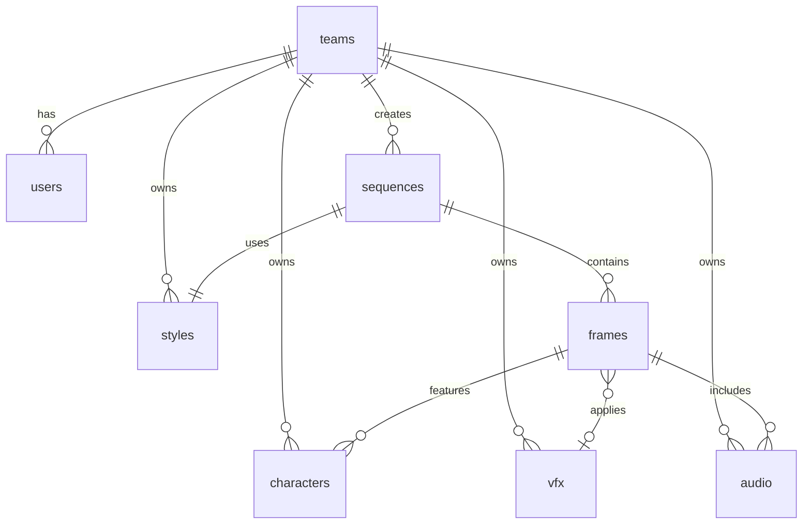
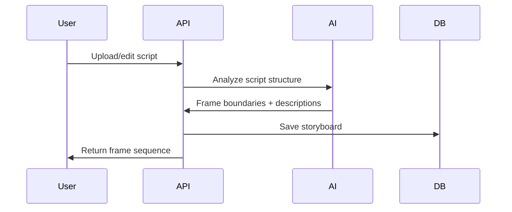
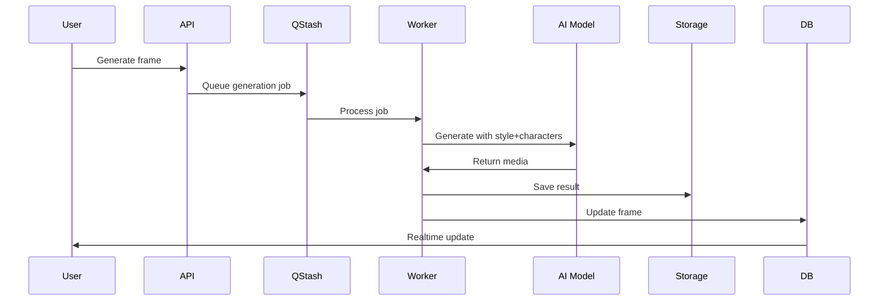

# OpenStory Technical Architecture

## Overview

OpenStory is a video sequence creation platform using AI models to transform scripts into consistent, styled video productions. Built on Next.js, Supabase, and QStash with a focus on simplicity and minimal architecture.

## Core Principles

- **Backend-only database access** - No direct client DB calls, avoiding RLS complexity
- **State management** - TanStack Query + reducers for clean component separation
- **UI simplicity** - shadcn/ui components with theme-driven styling
- **Anonymous-first** - Users can create without signup, upgrade to save work

## Data Model



### Core Entities

**teams**

- id, name, created_at
- Owns all creative assets (styles, characters, vfx, audio)
- All team members have full CRUD on team resources

**users**

- id, email, team_id
- Anonymous users: temporary session until signup
- Auth methods: Magic link, Passkeys only

**sequences**

- id, team_id, style_id, name
- script (text)
- storyboard (JSON)
- Script drives everything - name and storyboard auto-generate from script

**frames**

- id, sequence_id, order
- script_section (text reference)
- image_url (thumbnail)
- motion_url (video)
- character_ids[], audio_ids[], vfx_id
- AI analyzes script edits to adjust frame boundaries

**Asset Libraries** (per team)

- styles: Reusable Style Stacks for consistency
- characters: LoRA models for character consistency
- vfx: Special effects presets
- audio: Sound/music library

## Technical Stack

### Frontend (Vercel)

```typescript
// Component Architecture
/app
  /api           // Backend API routes only
  /(auth)        // Auth flows
  /(app)         // Main app
    /sequences   // Sequence CRUD
    /studio      // Editor interface
    /library     // Asset management

// State Management
- TanStack Query: Server state synchronization
- Reducers: Complex UI state (editor, timeline)
- Zustand: Light global state (user, team)
```

### Backend Architecture

```typescript
// API Layer (Next.js API Routes)

  /auth         // Supabase auth wrapper
  /sequences    // CRUD + generation
  /frames       // Frame management
  /generate     // AI generation endpoints
  /assets       // Library management
  /export       // Video compilation

// All DB operations through API
- No direct Supabase client calls
- Service layer handles all DB queries
- Consistent error handling and validation
```

### Infrastructure

**Supabase**

- PostgreSQL: Core data storage
- Auth: Magic links + Passkeys
- Storage: Generated media files
- Realtime: Generation status updates

**QStash (Upstash)**

```typescript
// Job Queue Structure
interface GenerationJob {
  type: 'frame' | 'video' | 'audio'
  sequenceId: string
  frameId?: string
  model: string
  parameters: object
  retries: number
}

// Workflow
1. User triggers generation
2. API creates QStash job
3. Worker processes via model API
4. Updates DB + notifies via Realtime
5. Frontend receives update via subscription
```

**AI Model Integration**

```typescript
// Unified model interface
interface AIProvider {
  generateImage(prompt: string, style: StyleStack): Promise<string>;
  generateVideo(image: string, motion: MotionParams): Promise<string>;
  analyzeScript(script: string): Promise<Frame[]>;
}

// Providers: Fal.ai, Runway, Kling, etc.
// Style Stacks ensure consistency across models
```

## Key Workflows

### 1. Script → Storyboard



### 2. Frame Generation



### 3. Anonymous → Authenticated Flow

1. User starts creating (localStorage session)
2. Generates frames without signup
3. Prompted to save: Email magic link or Passkey
4. Session transfers to authenticated user
5. Creates team, saves sequence

## Security Model

- **Authentication**: Supabase Auth (magic links, passkeys)
- **Authorization**: Team-based access control in API layer
- **Database**: No RLS, backend-only access via service account
- **API Security**:
  - Rate limiting per endpoint
  - Input validation (Zod schemas)
  - Sanitized error messages

## Development Guidelines

### Component Structure

```tsx
// Minimal component with no business logic
export function FrameEditor({ frameId }: Props) {
  const { data, mutate } = useFrame(frameId)  // TanStack Query
  const [state, dispatch] = useReducer(...)   // Complex UI state

  return (
    <Card>  {/* shadcn/ui only */}
      {/* No inline styles, use theme variables */}
    </Card>
  )
}
```

### API Pattern

```typescript
// Consistent API structure
export async function POST(req: Request) {
  // 1. Validate input
  const body = await validateRequest(schema, req)

  // 2. Check auth/permissions
  const { team } = await requireTeam(req)

  // 3. Execute business logic (DB calls here only)
  const result = await sequenceService.create(team.id, body)

  // 4. Queue async work if needed
  await qstash.publishJSON({...})

  // 5. Return standardized response
  return NextResponse.json({ data: result })
}
```

## Export & Delivery

**Supported Formats**

- MP4 video compilation
- Image sequence (PNG/JPEG)
- DaVinci Resolve XML
- Final Cut Pro XML
- Adobe Premiere project

**Export Pipeline**

1. Compile frame sequence
2. Apply transitions
3. Sync audio tracks
4. Render via FFmpeg
5. Upload to storage
6. Generate download link

## Monitoring & Analytics

- **Vercel Analytics**: Performance monitoring
- **Supabase Dashboard**: Database metrics
- **QStash Dashboard**: Job queue health
- **Custom Metrics**:
  - Generation success rates
  - Model performance comparison
  - Credit consumption per team

## Deployment

```yaml
# Production Environment
- Vercel: Auto-deploy from main branch
- Supabase: Production project
- QStash: Production queue
- Storage: Supabase Storage + CDN

# Staging Environment
- Vercel: Preview deployments
- Supabase: Staging project
- QStash: Staging queue
```

## Next Steps

1. **MVP Focus**: Script → Storyboard → Frame generation
2. **Phase 2**: Team collaboration, asset libraries
3. **Phase 3**: Advanced editing, VFX, export formats
4. **Phase 4**: Plugin ecosystem (DaVinci, Premiere)
