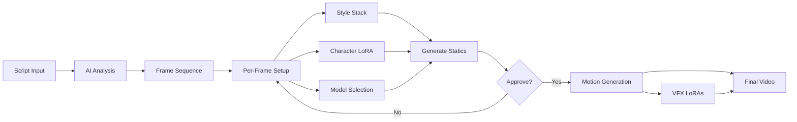
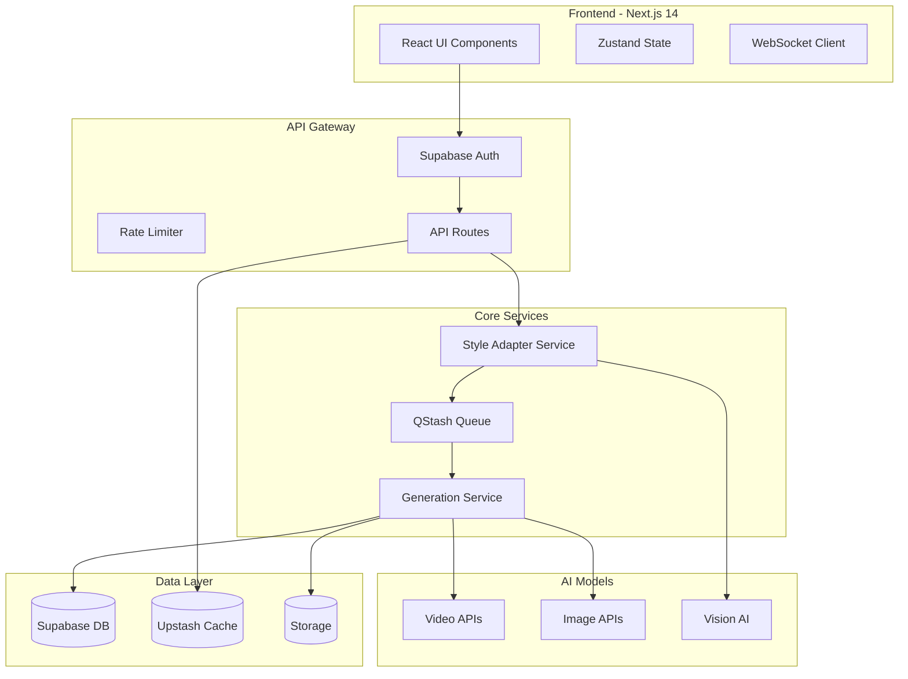

# Velro.ai Product Requirements Document

**Version:** 1.0  
**Date:** August 28, 2025  
**Status:** Ready for Development  
**Product Owner:** [Your Name]

---

## 1. Executive Summary

### 1.1 Vision
To democratize cinematic content creation by providing AI-powered tools that maintain consistent artistic vision across entire productions, from script to final cut.

### 1.2 Mission
Put cinematic power in the hands of anyone with a story to tell by blending AI with authentic human creativity through our revolutionary Style Stack technology.

### 1.3 Unique Value Proposition
Velro.ai is the first platform to solve the "consistency problem" in AI content generation through Style Stacks - intelligent, reusable presets that ensure artistic vision remains intact across all models and generations.

---

## 2. Product Overview

### 2.1 Core Innovation: Style Stacks

Style Stacks are dynamic JSON-based presets that capture and maintain consistent cinematic styles across 19+ AI models. Unlike competitors who require users to manually adjust prompts for each model, Style Stacks automatically adapt while preserving creative intent.

**Key Benefits:**
- 80% reduction in prompt iterations
- Consistent aesthetic across entire productions
- Monetizable creative assets via marketplace
- Model-agnostic implementation

### 2.2 Target Market

**Primary Users:**
- Independent filmmakers & directors (pre-visualization)
- Creative agencies (rapid prototyping)
- Content creators & YouTubers (10M+ creators)
- Video production studios (storyboarding)

**Market Size:**
- TAM: $15B (global video production software)
- SAM: $3B (AI-assisted video creation)
- SOM: $300M (3-year target)

### 2.3 Competitive Positioning

| Feature | Velro.ai | Runway | Pika | Krea.ai |
|---------|----------|---------|------|---------|
| Style Consistency | ✅ Style Stacks | ❌ Manual | ❌ Manual | ❌ Manual |
| Multi-Model Support | ✅ 19+ models | ⚠️ Limited | ❌ Single | ⚠️ Limited |
| Script-to-Video | ✅ Full pipeline | ⚠️ Partial | ❌ No | ❌ No |
| Director Presets | ✅ 50+ styles | ❌ No | ❌ No | ❌ No |
| Marketplace | ✅ Stack trading | ❌ No | ❌ No | ❌ No |
| Mobile-First | ✅ Responsive | ❌ Desktop | ⚠️ Limited | ❌ Desktop |

---

## 3. Feature Specifications

### 3.1 Style Stack System

#### 3.1.1 Core Components
```json
{
  "name": "Tarantino Noir",
  "version": "1.0",
  "base_template": {
    "description": "Scene narrative",
    "style": "Visual aesthetic",
    "camera": "Shot composition",
    "lighting": "Illumination setup",
    "setting": "Environment",
    "elements": ["Key objects"],
    "motion": "Temporal dynamics",
    "keywords": ["Semantic anchors"],
    "mood": "Emotional tone"
  },
  "model_adaptations": {
    "runway_gen3": { /* Specific adjustments */ },
    "pika_1.0": { /* Specific adjustments */ }
  },
  "persistent_elements": [
    {
      "type": "character",
      "ref_url": "storage/character.jpg",
      "description": "Lead character details"
    }
  ]
}
```

#### 3.1.2 Creation Methods
1. **Visual Upload**: Drag & drop reference images → AI analyzes → generates stack
2. **Director Templates**: Choose from 50+ prebuilt styles (Tarantino, Nolan, Wes Anderson)
3. **Manual Builder**: Component-by-component construction via UI
4. **Script Import**: Parse screenplay → extract visual style → generate stack

#### 3.1.3 Application Flow
1. User selects/creates stack
2. System validates compatibility with chosen model
3. Auto-adaptation engine adjusts for model specifics
4. Generation includes adapted parameters
5. Results maintain consistent style

### 3.2 Generation Pipeline

#### 3.2.1 Advanced Script-to-Storyboard Workflow

**Step 1: Script Analysis & Frame Creation**
```typescript
interface ScriptAnalysis {
  input: {
    script: string; // Pasted screenplay text
    format?: "fountain" | "fdx" | "plain";
  };
  
  aiProcessing: {
    breakDetection: "Identify scene/shot transitions";
    frameCalculation: "Determine optimal frame count per scene";
    descriptionGeneration: "Create detailed frame descriptions";
    characterExtraction: "Identify characters for LoRA suggestions";
  };
  
  output: {
    frames: Array<{
      id: string;
      sceneNumber: number;
      description: string;
      suggestedDuration: number;
      dialogueText?: string;
      characters: string[];
      suggestedModel: string;
    }>;
  };
}
```

**Step 2: Frame-Level Customization**
```typescript
interface FrameCustomization {
  perFrameControls: {
    styleStack: "Apply/modify style stack per frame";
    characterLoRAs: "Inject character-specific LoRAs";
    model: "Choose optimal model for this specific frame";
    description: "Edit AI-generated description";
    references: "Upload reference images";
  };
  
  batchOperations: {
    applyStackToAll: "Propagate style across frames";
    characterConsistency: "Lock character LoRA across scenes";
    modelPreference: "Set default model for frame types";
  };
}
```

**Step 3: Static Frame Generation**
```typescript
interface FrameGeneration {
  process: {
    queue: "Generate frames in parallel";
    preview: "Low-res quick preview first";
    highRes: "Full quality on approval";
  };
  
  controls: {
    regenerate: "Re-roll specific frames";
    variations: "Generate multiple options";
    tweakPrompt: "Fine-tune description";
    swapModel: "Try different AI model";
  };
}
```

**Step 4: Motion Generation**
```typescript
interface MotionPipeline {
  imageToVideo: {
    models: [
      "seedance", // Best for dance/movement
      "veo", // Best for cinematic shots
      "kling_2.1", // Best for action
      "wan_2.2" // VFX-capable with LoRAs
    ];
    
    vfxLoRAs: {
      available: ["explosions", "particles", "transformations", "magic"];
      application: "Only with wan_2.2 model";
      customUpload: true;
    };
  };
  
  motionControls: {
    duration: "2-10 seconds per shot";
    motionIntensity: "Subtle to dramatic";
    cameraMovement: "Static, pan, zoom, orbit";
    transitionStyle: "Cut, fade, morph";
  };
}
```

#### 3.2.2 Complete Production Pipeline


### 3.3 Marketplace & Monetization

#### 3.3.1 Stack Trading
- **List & Sell**: Creators price their stacks in credits
- **Preview System**: Auto-generate sample outputs
- **Licensing**: Choose between exclusive/non-exclusive
- **Royalties**: 70% to creator, 30% platform fee

#### 3.3.2 Credit Economy
```typescript
const CREDIT_SYSTEM = {
  purchasing: {
    starter: { credits: 500, usd: 29 },
    pro: { credits: 2000, usd: 99 },
    studio: { credits: 10000, usd: 399 }
  },
  consumption: {
    imageGen: 2, // credits per image
    videoGen: 10, // credits per second
    stackPurchase: "Variable", // 50-500 credits
    enhancement: 5 // credits per enhancement
  },
  earning: {
    stackSale: "70% of price",
    referral: "100 bonus credits",
    communityContrib: "50 credits"
  }
};
```

### 3.5 Advanced Frame Control System

#### 3.5.1 Frame Editor Interface
```typescript
interface FrameEditor {
  layout: {
    timeline: "Horizontal scrollable frame sequence";
    canvas: "Main editing area for selected frame";
    inspector: "Properties panel for frame details";
    library: "LoRAs, Style Stacks, references";
  };
  
  frameProperties: {
    // Core Properties
    description: string;
    model: AIModel;
    styleStack?: StyleStack;
    
    // Character Management
    characterLoRAs: Array<{
      character: string;
      loraPath: string;
      weight: number;
    }>;
    
    // Advanced Controls
    seed?: number; // For consistency
    aspectRatio: "16:9" | "9:16" | "1:1" | "custom";
    quality: "draft" | "standard" | "premium";
    
    // Motion Settings (for later conversion)
    plannedMotion: {
      type: "static" | "pan" | "zoom" | "action";
      intensity: 1-10;
      duration: number;
      vfxNeeded: boolean;
    };
  };
}
```

#### 3.5.2 LoRA Management System
```typescript
interface LoRASystem {
  characterLoRAs: {
    upload: "User uploads training images";
    train: "Auto-train via partners or self-hosted";
    library: "Saved character models";
    sharing: "Team-wide character consistency";
  };
  
  vfxLoRAs: {
    prebuilt: [
      "explosion_michael_bay",
      "magic_particles_disney",
      "transformation_transformers",
      "destruction_marvel",
      "energy_blast_anime",
      "weather_fx_realistic"
    ];
    custom: "Upload custom VFX LoRAs";
    compatibility: "WAN 2.2 exclusive";
  };
  
  styleLoRAs: {
    artistic: "Specific artist styles";
    technical: "Lighting, camera styles";
    genre: "Horror, sci-fi, romance";
  };
}
```

#### 3.5.3 Frame-to-Motion Intelligence
```typescript
interface SmartMotionSuggestions {
  analysis: {
    contentType: "Detect action vs dialogue vs establishing";
    emotionalTone: "Match motion to scene mood";
    pacing: "Suggest duration based on script";
  };
  
  recommendations: {
    model: "Best video model for this content";
    motionType: "Suggested camera movement";
    vfxOpportunities: "Where VFX would enhance";
    duration: "Optimal shot length";
  };
  
  presets: {
    dialogue: { model: "veo", motion: "subtle", duration: 3 };
    action: { model: "kling_2.1", motion: "dynamic", duration: 5 };
    vfx_heavy: { model: "wan_2.2", motion: "complex", duration: 7 };
    establishing: { model: "seedance", motion: "smooth", duration: 4 };
  };
}
```

### 3.6 Credit Optimization Engine

Given the sophisticated multi-step workflow, users need smart credit management:

```typescript
interface CreditOptimization {
  estimation: {
    beforeGeneration: {
      scriptAnalysis: 0, // Free
      framePreview: 1, // Credit per frame
      staticGeneration: 2-5, // Based on model/quality
      motionGeneration: 10-30, // Based on duration/model
      vfxEnhancement: 5-15, // Additional for VFX LoRAs
    };
    
    totalEstimate: "Show before confirming";
    alternativeOptions: "Suggest cheaper models";
  };
  
  savingStrategies: {
    batchProcessing: "10% discount for 10+ frames";
    offPeakGeneration: "20% discount 2am-6am";
    lowerQualityDrafts: "50% less for draft mode";
    modelSubstitution: "Suggest cheaper alternatives";
  };
  
  budgetControls: {
    projectCap: "Set max credits per project";
    alerts: "Warn at 80% usage";
    approval: "Require confirmation over X credits";
  };
}
```

---

## 4. Technical Architecture

### 4.1 System Design



### 4.2 Database Schema

```sql
-- Core Tables
CREATE TABLE users (
    id UUID PRIMARY KEY,
    email TEXT UNIQUE,
    credits INTEGER DEFAULT 100,
    subscription_tier TEXT,
    created_at TIMESTAMPTZ
);

CREATE TABLE style_stacks (
    id UUID PRIMARY KEY,
    user_id UUID REFERENCES users(id),
    name TEXT,
    base_json JSONB,
    adaptations JSONB,
    version INTEGER,
    is_public BOOLEAN DEFAULT false,
    price_credits INTEGER,
    created_at TIMESTAMPTZ
);

CREATE TABLE generations (
    id UUID PRIMARY KEY,
    user_id UUID REFERENCES users(id),
    stack_id UUID REFERENCES style_stacks(id),
    model TEXT,
    input_prompt TEXT,
    adapted_prompt JSONB,
    output_url TEXT,
    credits_used INTEGER,
    status TEXT,
    created_at TIMESTAMPTZ
);

CREATE TABLE marketplace_transactions (
    id UUID PRIMARY KEY,
    buyer_id UUID REFERENCES users(id),
    seller_id UUID REFERENCES users(id),
    stack_id UUID REFERENCES style_stacks(id),
    credits INTEGER,
    created_at TIMESTAMPTZ
);
```

### 4.3 API Specification

```typescript
// Core API Endpoints
interface VelroAPI {
  // Style Stack Operations
  "/stacks": {
    POST: CreateStack;
    GET: ListUserStacks;
  };
  "/stacks/:id": {
    GET: GetStack;
    PUT: UpdateStack;
    DELETE: DeleteStack;
  };
  "/stacks/:id/adapt": {
    POST: AdaptStackForModel;
  };
  
  // Generation Operations
  "/generate": {
    POST: StartGeneration;
  };
  "/generate/:id": {
    GET: GetGenerationStatus;
  };
  
  // Marketplace
  "/marketplace": {
    GET: BrowseStacks;
    POST: ListStackForSale;
  };
  "/marketplace/:id/purchase": {
    POST: PurchaseStack;
  };
}
```

### 4.4 Security Implementation

```typescript
const SECURITY_CONFIG = {
  // Authentication
  auth: {
    provider: "Supabase Auth",
    mfa: "Optional TOTP",
    sessions: "JWT with refresh tokens"
  },
  
  // API Security
  api: {
    rateLimit: {
      anonymous: "10 req/min",
      authenticated: "100 req/min",
      pro: "1000 req/min"
    },
    encryption: "TLS 1.3",
    cors: "Whitelist origins"
  },
  
  // Content Moderation
  moderation: {
    preCheck: "OpenAI Moderation API",
    postCheck: "AWS Rekognition",
    reporting: "User flagging system"
  },
  
  // Data Protection
  data: {
    encryption: "AES-256 at rest",
    backups: "Daily automated",
    retention: "90 days minimum",
    gdpr: "Full compliance"
  }
};
```

---

## 5. User Experience Design

### 5.1 Key User Flows

#### Flow 1: First-Time Creator
1. Sign up → Receive 100 free credits
2. Tutorial: "Create Your First Stack"
3. Choose template (e.g., "Cinematic Drama")
4. Generate sample storyboard
5. Save and share result

#### Flow 2: Professional Workflow
1. Import script from Final Draft
2. Select or create custom stack
3. Generate full storyboard
4. Refine specific shots
5. Export to DaVinci Resolve

#### Flow 3: Stack Monetization
1. Create unique style stack
2. Generate preview samples
3. Set price (50-500 credits)
4. List on marketplace
5. Track earnings dashboard

### 5.2 UI/UX Principles

- **Mobile-First**: Every feature works on mobile
- **Progressive Disclosure**: Simple default, advanced on demand
- **Visual Feedback**: Real-time generation previews
- **Accessibility**: WCAG 2.1 AA compliance
- **Performance**: <3s initial load, <100ms interactions

---

## 6. Go-to-Market Strategy

### 6.1 Launch Phases

**Phase 1: Private Beta (Month 1-2)**
- 100 hand-picked creators
- Focus: Style Stack refinement
- Goal: 10 exceptional example productions

**Phase 2: Public Beta (Month 3-4)**
- 1,000 users waitlist
- Focus: Marketplace launch
- Goal: 100 stacks created

**Phase 3: General Availability (Month 5)**
- Open registration
- Launch marketing campaign
- Goal: 10,000 users

### 6.2 Pricing Strategy (Bootstrap-Friendly)

```typescript
const PRICING_MODEL = {
  // Subscription Tiers (includes base credits)
  subscriptions: {
    free: {
      monthly: 0,
      credits: 25,
      features: ["Basic storyboarding", "2 models", "SD quality"],
      target: "Trial users"
    },
    starter: {
      monthly: 29,
      credits: 300,
      features: ["All models", "HD quality", "Character LoRAs"],
      target: "Content creators"
    },
    professional: {
      monthly: 99,
      credits: 1200,
      features: ["4K quality", "Priority queue", "Style Stack saving"],
      target: "Production studios"
    },
    studio: {
      monthly: 299,
      credits: 4000,
      features: ["Custom LoRAs", "API access", "Team workspace"],
      target: "Agencies"
    }
  },
  
  // Credit Top-Ups (pay-as-you-go)
  creditPacks: {
    small: { credits: 100, price: 12 },    // $0.12/credit
    medium: { credits: 500, price: 55 },   // $0.11/credit
    large: { credits: 2000, price: 200 },  // $0.10/credit
    bulk: { credits: 10000, price: 900 }   // $0.09/credit
  },
  
  // Cost Structure (Bootstrap sustainable)
  unitEconomics: {
    imageGeneration: {
      apiCost: 0.02,      // Average across models
      userPrice: 2,       // credits
      margin: "15-20%"    // After platform costs
    },
    videoGeneration: {
      apiCost: 0.10,      // Per second average
      userPrice: 10,      // credits per second
      margin: "15-20%"
    },
    storage: {
      cost: 0.023,        // Per GB/month (Supabase)
      included: "10GB per user",
      overage: 5          // credits per GB
    }
  }
};
```

### 6.3 Growth Tactics

1. **Creator Partnerships**: Partner with 10 YouTube filmmakers
2. **Style Stack Contests**: Monthly themed competitions
3. **Educational Content**: "AI Filmmaking 101" course
4. **Referral Program**: 100 credits per referral
5. **Community Building**: Discord server for creators

---

## 7. Success Metrics

### 7.1 North Star Metrics
- **Primary**: Monthly Active Creators (target: 10,000 by month 6)
- **Secondary**: Stacks created per user (target: 5+)
- **Tertiary**: Marketplace transaction volume (target: $50K/month)

### 7.2 Key Performance Indicators

```typescript
const KPIs = {
  acquisition: {
    signups: "1,000/week",
    conversion: "15% free to paid",
    CAC: "<$50"
  },
  engagement: {
    DAU_MAU: ">40%",
    generationsPerUser: "20/month",
    stacksCreated: "2/month"
  },
  retention: {
    day7: ">60%",
    day30: ">40%",
    churnRate: "<5% monthly"
  },
  monetization: {
    ARPU: "$45",
    LTV: "$540",
    marketplaceTakeRate: "30%"
  }
};
```

---

## 8. Risk Analysis & Mitigation

### 8.1 Technical Risks

| Risk | Impact | Probability | Mitigation |
|------|--------|-------------|------------|
| API Provider Outage | High | Medium | Multi-provider redundancy |
| Generation Quality Issues | High | Low | Quality scoring & fallbacks |
| Scaling Bottlenecks | Medium | Medium | Queue system & caching |
| Security Breach | High | Low | Regular audits & encryption |

### 8.2 Business Risks

| Risk | Impact | Probability | Mitigation |
|------|--------|-------------|------------|
| Competitor Feature Copy | Medium | High | Rapid innovation & patents |
| API Price Increases | High | Medium | Margin buffer & optimization |
| Low Marketplace Adoption | Medium | Medium | Creator incentives |
| Regulatory Changes | High | Low | Legal compliance team |

---

## 9. Development Roadmap

### 9.1 MVP (Weeks 1-8) - FOCUSED SCOPE with Fal.ai Models
**Core Feature: Script-to-Storyboard with Generation**

- [ ] **Script Processing**
  - [ ] Script paste interface
  - [ ] AI scene/frame breakdown
  - [ ] Frame sequence builder
  - [ ] Frame description generation

- [ ] **Frame Editor**
  - [ ] Individual frame customization
  - [ ] Model selection per frame (Fal.ai models)
  - [ ] Character LoRA integration (flux-krea-lora)
  - [ ] Basic style stack application

- [ ] **Generation Pipeline - Fal.ai Integration**
  - [ ] **Image Generation (4 models)**
    - [ ] flux-pro/kontext/max (context-aware)
    - [ ] imagen4/preview/ultra (photorealistic)
    - [ ] flux-pro/v1.1-ultra (artistic)
    - [ ] flux-krea-lora (character consistency)
  - [ ] **Video Generation (4 models)**
    - [ ] veo3 (cinematic text-to-video)
    - [ ] kling-video/v2.1 (image-to-video)
    - [ ] minimax/hailuo-02/pro (fast generation)
    - [ ] wan-pro (basic, VFX in Phase 2)
  - [ ] Queue management with QStash
  - [ ] Real-time status updates via Supabase

- [ ] **Core Infrastructure**
  - [ ] Supabase auth & database with real-time
  - [ ] Fal.ai API integration layer
  - [ ] Credit system with subscriptions
  - [ ] Basic security (RLS, HTTPS, rate limiting)

- [ ] **Essential UI**
  - [ ] Dashboard with generation history
  - [ ] Frame timeline view
  - [ ] Model recommendation system
  - [ ] Credit balance display with estimates
  - [ ] Export (MP4, images, basic XML)

### 9.2 Phase 2 (Months 3-4) - Post-Funding Development
- [ ] **DaVinci Resolve Plugin** (Priority Roadmap)
  - [ ] XML export with EDL
  - [ ] Direct plugin integration
  - [ ] Round-trip editing

- [ ] **Advanced Features**
  - [ ] Style Stack marketplace
  - [ ] VFX LoRAs (WAN 2.2 integration)
  - [ ] Advanced JSON editor
  - [ ] Team workspaces

- [ ] **Platform Expansion**
  - [ ] More video models (Veo, Haiper, SeeDance)
  - [ ] Batch generation mode
  - [ ] Auto-story generation for brands
  - [ ] Mobile app (React Native)

### 9.3 Phase 3 (Months 5-6) - Scale & Innovation
- [ ] VELRO proprietary model
- [ ] ComfyUI self-hosted integration
- [ ] Enterprise features (SSO, SLA)
- [ ] API for developers
- [ ] Advanced analytics dashboard

---

## 10. Team & Resources

### 10.1 Required Team
- **Engineering**: 2 Full-stack, 1 Backend, 1 ML Engineer
- **Design**: 1 Product Designer, 1 Motion Designer
- **Product**: 1 Product Manager
- **Marketing**: 1 Growth Marketer
- **Operations**: 1 Customer Success

### 10.2 Budget Allocation
- **Development**: 40%
- **API Costs**: 25%
- **Marketing**: 20%
- **Operations**: 10%
- **Reserve**: 5%

---

## 11. Success Criteria

**Year 1 Goals:**
- 50,000 registered users
- 5,000 paying subscribers
- $2M ARR
- 1,000 stacks in marketplace
- 4.5+ app store rating

**Long-term Vision:**
- Become the default creative OS for AI filmmaking
- Power 10% of all AI-generated content
- $100M ARR within 3 years
- Acquisition or IPO path

---

## Appendix A: Technical Specifications

[Detailed API documentation, database schemas, and integration guides]

## Appendix B: Design System

[UI components, style guide, and interaction patterns]

## Appendix C: Legal & Compliance

[Terms of service, privacy policy, content guidelines]