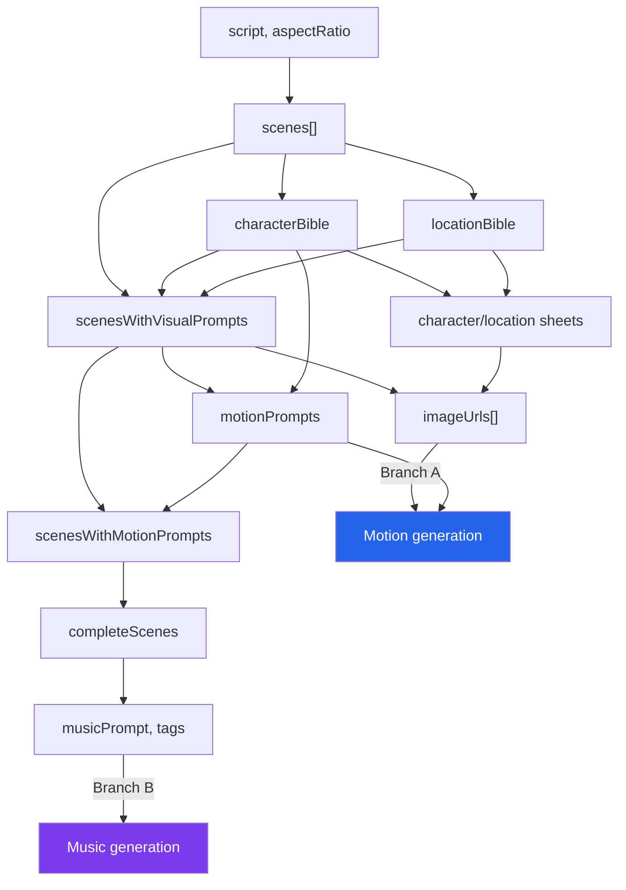
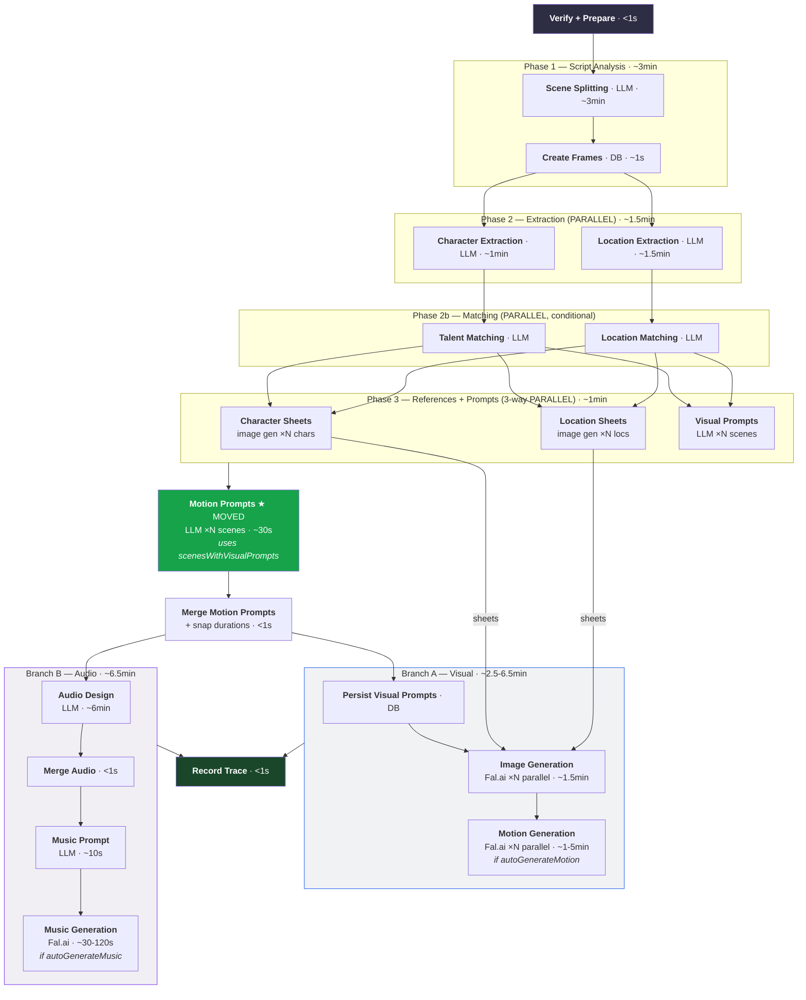

# Optimized Analyze-Script Workflow

Companion to [`workflow.md`](./workflow.md). Documents four optimizations to the analyze-script pipeline that reduce the critical path from ~15 min to ~12.5 min for a 9-scene run.

## Data Dependency Graph

Every phase's true inputs and outputs, traced from the code (`src/lib/workflows/analyze-script-workflow.ts`):

| Phase | Step                 | Inputs (what it actually reads)                                                        | Outputs                          | Code reference                                                                   |
| ----- | -------------------- | -------------------------------------------------------------------------------------- | -------------------------------- | -------------------------------------------------------------------------------- |
| 1     | Scene splitting      | `script`, `aspectRatio`                                                                | `scenes[]`                       | L163-179                                                                         |
| 1b    | Create frames        | `scenes[]`, `sequenceId`                                                               | frame DB rows                    | L181-240                                                                         |
| 2     | Character extraction | `scenes[]`                                                                             | `characterBible`                 | L243-258                                                                         |
| 2     | Location extraction  | `scenes[]`                                                                             | `locationBible`                  | L260-275                                                                         |
| 2b    | Talent matching      | `characterBible`, `suggestedTalentIds`                                                 | `talentCharacterMatches`         | L278-367                                                                         |
| 2b    | Location matching    | `locationBible`, `suggestedLocationIds`                                                | `libraryLocationMatches`         | L370-462                                                                         |
| 3     | Character sheets     | `characterBible`, `talentCharacterMatches`                                             | `charactersWithSheets`           | L466-476                                                                         |
| 3     | Location sheets      | `locationBible`, `libraryLocationMatches`                                              | `locationsWithSheets`            | L477-486                                                                         |
| 3     | Visual prompts       | `scenes[]`, `characterBible`, `locationBible`, `styleConfig`, `aspectRatio`            | `scenesWithVisualPrompts`        | L488-499                                                                         |
| 5     | Motion prompts       | `scenesWithVisualPrompts`, `characterBible`, `styleConfig`, `aspectRatio`              | `motionPrompts[]`                | L636-648 (bug: currently passes `scenes[]` instead of `scenesWithVisualPrompts`) |
| 4     | Image generation     | `scenesWithVisualPrompts`, `charactersWithSheets`, `locationsWithSheets`, `imageModel` | `imageUrls[]` + frame DB updates | L542-627                                                                         |
| 6     | Audio design         | `scenesWithMotionPrompts` (visual prompts + motion prompts merged)                     | `completeScenes`                 | L720-739                                                                         |
| 7     | Music prompt         | `completeScenes` (with audio design)                                                   | `musicPrompt`, `tags`            | L812-825                                                                         |
| 7     | Motion generation    | `imageUrls[]`, `motionPrompts[]`, `videoModel`                                         | `videoUrl` frame DB updates      | L838-881                                                                         |
| 7     | Music generation     | `musicPrompt`, `totalDuration`, `musicModel`                                           | `musicUrl` sequence DB update    | L883-903                                                                         |

Key insight: arrows show what each step **actually reads**, not just what runs before it.



## Optimizations

### 1. Parallel Character + Location Extraction

**Current (sequential):** ~2.5 min

```
Character extraction (~1 min) → Location extraction (~1.5 min)
```

**Optimized (parallel):** ~1.5 min

```
Character extraction (~1 min) ─┐
                                ├→ both complete
Location extraction (~1.5 min) ─┘
```

**Why it works:** Both read only `scenes[]` (L243-275). Neither reads the other's output. Character extraction produces `characterBible`; location extraction produces `locationBible`. These are consumed independently downstream.

**Code change:** Wrap the two `durableLLMCall` invocations in `Promise.all`.

**Savings:** ~1 min (character extraction runs under location extraction).

**Risk:** Two concurrent LLM calls instead of one. Acceptable — Phase 3 already runs three concurrent sub-workflows, and the LLM provider handles parallel requests.

---

### 2. Parallel Talent + Location Matching

**Current (sequential):**

```
get-talent-list → talent-matching LLM → build-matches →
get-library-locations → location-matching LLM → build-location-matches
```

**Optimized (parallel):**

```
get-talent-list → talent-matching → build-matches ────────┐
                                                           ├→ both complete
get-library-locations → location-matching → build-matches ─┘
```

**Why it works:** Talent matching reads `characterBible` + `talentList` (L278-367). Location matching reads `locationBible` + `libraryLocationList` (L370-462). No cross-dependency — each chain uses a different bible and a different library list.

**Code change:** Wrap the two matching chains in `Promise.all`.

**Savings:** Minor (both are typically <1s each, often skipped entirely). The value is primarily in unblocking the pipeline faster when both are enabled.

**Risk:** Minimal. Both matching chains are independent DB lookups + LLM calls.

---

### 3. Motion Prompts After Phase 3 (with visual prompt data)

**Current:** Motion prompts run after image generation (L636), blocking audio design. They receive `scenes[]` (L636-648) instead of `scenesWithVisualPrompts` — this is a bug that produces lower quality motion prompts.

```
Phase 3 (3-way parallel) → Image Gen → Motion Prompts (uses raw scenes) → Audio Design
```

**Optimized:** Motion prompts run immediately after Phase 3, consuming `scenesWithVisualPrompts` for higher quality output.

```
Phase 3 (3-way parallel) → Motion Prompts (uses scenesWithVisualPrompts, ~30s) → Branch fork
```

**Why it works:** Motion prompts describe camera movement for a specific visual composition. The LLM template takes `{{scene}}` as full JSON — when visual prompt data is present (composition, framing, depth), the LLM generates more coherent camera movement. For example, knowing "wide shot, character foreground, mountains behind" produces better motion direction than working from raw scene metadata alone. The merge step (L651-689) already uses `scenesWithVisualPrompts` as its base, confirming the visual data is expected to flow through.

**Code changes:**

1. Pass `scenesWithVisualPrompts` instead of `scenes` to `motionPromptWorkflow` (bug fix)
2. Move motion prompt invocation from after image gen to immediately after Phase 3

**Savings:** ~30s net savings. Motion prompts move off the critical path between image gen and audio design. They add ~30s after Phase 3, but audio design no longer waits for image gen + motion prompts (~2 min saved), minus the 30s added = ~1.5 min net improvement at this stage.

**Quality improvement:** Motion prompts now have access to visual composition data, producing better-aligned camera movement descriptions.

**Risk:** One additional sequential step (~30s) between Phase 3 and the branch fork. This is a deliberate tradeoff — ~30s of latency for meaningfully better motion prompt quality.

---

### 4. Two Parallel Branches After Motion Prompts

**Current (fully sequential after Phase 3):**

```
Phase 3 → Image Gen → Motion Prompts → Audio Design → Music Prompt → [Motion Gen, Music Gen]
```

**Optimized (two independent branches after motion prompts):**

```
Phase 3 → Motion Prompts (~30s) ──┬→ Branch A (visual):  Image Gen → Motion Gen (if enabled)
                                   │
                                   └→ Branch B (audio):  Audio Design → Music Prompt → Music Gen (if enabled)
```

**Why it works:**

- **Image gen** needs: `scenesWithVisualPrompts` + `charactersWithSheets` + `locationsWithSheets` (all from Phase 3). Does NOT need motion prompts or audio design.
- **Audio design** needs: `scenesWithMotionPrompts` — the merge of visual prompts + motion prompts (both available after motion prompts complete). Does NOT need images or character/location sheets.
- **Motion gen** needs: `imageUrls[]` + `motionPrompts[]` (L862-874). Does NOT need audio design or music prompt.
- **Music gen** needs: `musicPrompt` + `tags` + `totalDuration` (L888-902). Does NOT need images or motion videos.

The two branches share no data after the motion prompt step.

**Code change:**

1. After Phase 3, run motion prompts (consuming `scenesWithVisualPrompts`).
2. Merge `scenesWithVisualPrompts` + `motionPrompts` → `scenesWithMotionPrompts` (pure data merge, <1ms).
3. Fork into two `Promise.all` branches:
   - **Branch A:** Persist visual prompts → Image gen → (if autoGenerateMotion) Motion gen
   - **Branch B:** Audio design → Merge audio → Music prompt → (if autoGenerateMusic) Music gen
4. `await Promise.all([branchA, branchB])` before recording the trace.

**Savings:** Up to ~6 min. Audio design (~6 min) runs in parallel with image gen (~1.5 min) + motion gen (~1-5 min). The critical path is whichever branch is longer — typically Branch B (audio design is the bottleneck at ~6 min).

**Risk:**

- Both branches update frame metadata. Branch A writes `thumbnailUrl`/`videoUrl`, `thumbnailStatus`/`videoStatus` to frames. Branch B writes `metadata` (scene object with audio design). These are different columns — Drizzle's `updateFrame` uses partial `set()` calls, so no conflict.
- The motion prompt metadata persist (`update-frames-after-motion-prompts`) now happens before the branch fork, not inside Branch A. This eliminates a potential write conflict — both branches no longer compete to write `metadata`.
- Event ordering changes: UI will receive image progress events and audio design events interleaved rather than sequentially. The UI already handles events independently per frame, so this should work.
- `completeScenes` (used for the final trace) needs audio design but NOT images/videos (those are on the frame record, not the scene object). Branch B produces `completeScenes`; Branch A doesn't modify it.

---

## Optimized Pipeline



## Critical Path Comparison

| Phase                                   | Current                       | Optimized                                 | Saved              |
| --------------------------------------- | ----------------------------- | ----------------------------------------- | ------------------ |
| Scene splitting + frame creation        | ~3 min                        | ~3 min                                    | —                  |
| Character + location extraction         | ~2.5 min (sequential)         | ~1.5 min (parallel)                       | **~1 min**         |
| Talent + location matching              | <1s (sequential)              | <1s (parallel)                            | minor              |
| Phase 3: refs + prompts                 | ~1 min (3-way)                | ~1 min (3-way)                            | —                  |
| Motion prompts                          | ~30s (after image gen)        | ~30s (after Phase 3, uses visual prompts) | —                  |
| Motion prompt merge                     | —                             | <1s (new step)                            | —                  |
| Image gen                               | ~1.5 min                      | ~1.5 min (Branch A)                       | —                  |
| Audio design                            | ~6 min (after motion prompts) | ~6 min (Branch B, parallel with A)        | —                  |
| Music prompt                            | ~10s                          | ~10s                                      | —                  |
| Motion gen (if enabled)                 | ~1-5 min (after music prompt) | ~1-5 min (after image gen)                | **up to ~6.5 min** |
| Music gen (if enabled)                  | ~30-120s                      | ~30-120s                                  | —                  |
| **Critical path (no motion/music)**     | **~14.5 min**                 | **~12.5 min**                             | **~2 min**         |
| **Critical path (with motion + music)** | **~15-19 min**                | **~14 min**                               | **~1-5 min**       |

The critical path shifts from the sequential chain to `max(Branch A, Branch B)`. Branch B (audio design at ~6 min) is typically the bottleneck, so Branch A (image gen ~1.5 min + motion gen ~1-5 min) runs "for free" in parallel. Motion prompts add ~30s before the fork (vs being absorbed into Phase 3), but this produces higher quality output by using visual prompt composition data.

## QStash Step Count Impact

Each optimization changes the QStash step topology:

| Optimization                 | Step change                                                                  | Net impact              |
| ---------------------------- | ---------------------------------------------------------------------------- | ----------------------- |
| Parallel extraction          | 2 sequential → 2 parallel (via `Promise.all` inside `context.run`)           | No new steps            |
| Parallel matching            | 2 chains sequential → 2 chains parallel                                      | No new steps            |
| Motion prompts after Phase 3 | 1 `context.invoke` moves earlier (after visual prompts, not after image gen) | No new steps            |
| Two branches                 | 1 sequential chain → 2 `Promise.all` branches                                | No new steps, reordered |

Total QStash step count is unchanged — only execution order changes.

## Risks and Tradeoffs

### LLM Concurrency

Optimization #1 increases peak concurrent LLM calls:

- **Current peak:** 3 (during Phase 3: char sheets, loc sheets, visual prompts — though sheets are image gen, not LLM)
- **Optimized peak:** Same LLM concurrency. Character + location extraction are parallel but happen before Phase 3, not during it. Motion prompts run after Phase 3 (not inside it), so they don't add to Phase 3's concurrency.

### Database Write Conflicts

Motion prompt metadata persist (`update-frames-after-motion-prompts`) now happens before the branch fork, eliminating a potential write conflict. During the branch fork:

- Branch A writes `thumbnailUrl`, `videoUrl`, `thumbnailStatus`, `videoStatus` to frames, plus `update-frames-after-visual-prompts` (metadata with visual prompts)
- Branch B writes `metadata` (scene object with audio design via `update-frames-after-audio-design`)

Branch A's visual prompt metadata write happens first (it's the persist-visual-prompts step, which runs before image gen). Branch B's audio design write happens later and includes all accumulated data. Branch B's final write (`update-frames-after-audio-design`) writes `completeScenes` which has everything — no data loss.

### Event Ordering

The UI receives events from both branches interleaved. This means:

- `generation.image:progress` events arrive while audio design is running
- `generation.frame:updated` (visual-prompt) and `generation.frame:updated` (audio-design) may arrive close together

The UI already handles each event type independently, so this should be transparent.

### Failure Isolation

If Branch A fails (image gen error), Branch B can still complete audio design and music. The workflow's `failureFunction` catches the top-level error and marks the sequence as failed. This behavior is unchanged — the `Promise.all` will reject when either branch throws.

To improve resilience, branches could use `Promise.allSettled` instead, allowing partial success (images generated but no music, or vice versa). This is a separate enhancement.

### Rollback

All four optimizations are independent and can be applied incrementally. If any optimization causes issues, it can be reverted without affecting the others.
