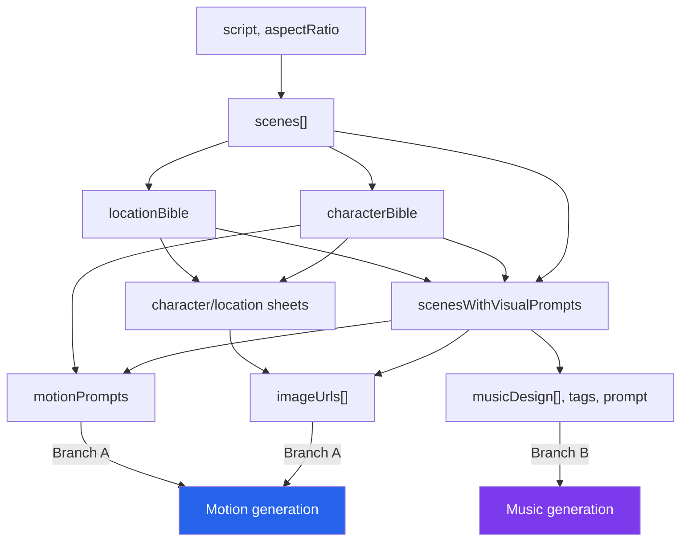
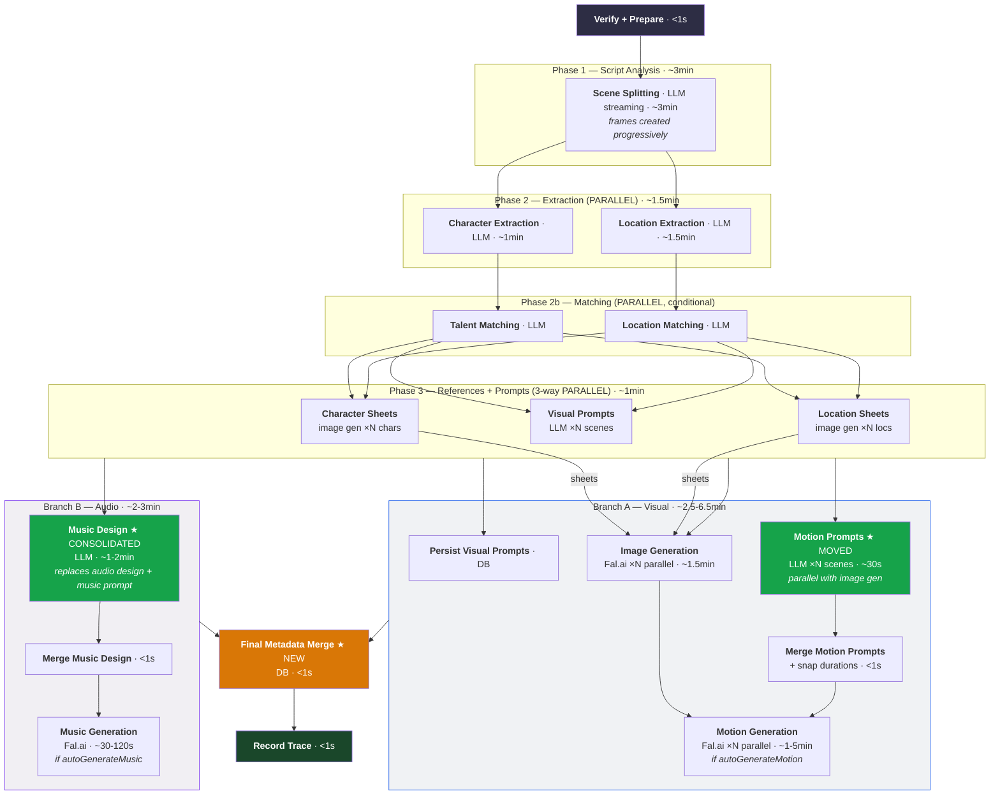

# Optimized Analyze-Script Workflow

Companion to [`workflow.md`](./workflow.md). Documents implemented and planned optimizations to the analyze-script pipeline.

## Implemented Optimizations

Three optimizations have been shipped on this branch:

1. **Streaming scene parser** — Phase 1 uses `durableStreamingSceneSplit()` to create frames progressively as scenes stream from the LLM, instead of waiting for the full response. No timing improvement on the critical path, but frames appear in the UI immediately. Steps: `prepare-scene-splitting` → `scene-splitting-stream` → `reconcile-frames` → `deduct-llm-credits-scene-splitting` + `log-scene-splitting`.

2. **Music design consolidation** — Old Phase 6 (Audio Design, ~6 min LLM) + Phase 7 (Music Prompt, ~10s LLM) replaced by a single "Music Design" LLM call (`music-design-chat` → `musicDesignResultSchema`). Returns per-scene `musicDesign` (presence/style/mood/atmosphere) + unified `tags` + `prompt`. **Saves ~4 min** by eliminating the audio design bottleneck and one entire LLM call.

3. **Batched motion polling** — Motion workflow uses tight-loop polling inside `context.run()` steps (30s batches, up to 15 min) instead of per-poll QStash steps. **~10x reduction in QStash steps** per motion generation.

### Updated Baseline

With music design consolidation, the current sequential pipeline takes **~9-10 min** (down from ~15 min) for a 9-scene run without motion/music generation. The music design step (~1-2 min) replaces the old audio design bottleneck (~6 min).

## Planned Optimizations

Four parallelization optimizations remain as future work. Timing estimates below use the updated baseline (music design ~1-2 min, not audio design ~6 min).

## Data Dependency Graph

Every phase's true inputs and outputs, traced from the code (`src/lib/workflows/analyze-script-workflow.ts`):

| Phase | Step                        | Inputs (what it actually reads)                                                                   | Outputs                           | Code reference                               |
| ----- | --------------------------- | ------------------------------------------------------------------------------------------------- | --------------------------------- | -------------------------------------------- |
| 1     | Scene splitting (streaming) | `script`, `aspectRatio`                                                                           | `scenes[]`, `frameMapping[]`      | streaming-scene-split steps                  |
| 2     | Character extraction        | `scenes[]`                                                                                        | `characterBible`                  | L243-258                                     |
| 2     | Location extraction         | `scenes[]`                                                                                        | `locationBible`                   | L260-275                                     |
| 2b    | Talent matching             | `characterBible`, `suggestedTalentIds`                                                            | `talentCharacterMatches`          | L278-367                                     |
| 2b    | Location matching           | `locationBible`, `suggestedLocationIds`                                                           | `libraryLocationMatches`          | L370-462                                     |
| 3     | Character sheets            | `characterBible`, `talentCharacterMatches`                                                        | `charactersWithSheets`            | L466-476                                     |
| 3     | Location sheets             | `locationBible`, `libraryLocationMatches`                                                         | `locationsWithSheets`             | L477-486                                     |
| 3     | Visual prompts              | `scenes[]`, `characterBible`, `locationBible`, `styleConfig`, `aspectRatio`                       | `scenesWithVisualPrompts`         | L488-499                                     |
| 4     | Image generation            | `scenesWithVisualPrompts`, `charactersWithSheets`, `locationsWithSheets`, `imageModel`            | `imageUrls[]` + frame DB updates  | L542-627                                     |
| 4     | Motion prompts              | `scenesWithVisualPrompts`, `characterBible`, `styleConfig`, `aspectRatio`                         | `motionPrompts[]`                 | L636-648 (Branch A, parallel with image gen) |
| 6     | Music design                | `sceneSummaries` (sceneId, title, storyBeat, durationSeconds, location, timeOfDay, visualSummary) | `musicDesign[]`, `tags`, `prompt` | music-design step                            |
| 7     | Motion generation           | `imageUrls[]`, `motionPrompts[]`, `videoModel`                                                    | `videoUrl` frame DB updates       | L838-881                                     |
| 7     | Music generation            | `musicPrompt`, `totalDuration`, `musicModel`                                                      | `musicUrl` sequence DB update     | L883-903                                     |

Key insight: arrows show what each step **actually reads**, not just what runs before it.



### 1. Parallel Character + Location Extraction

**Current (sequential):** ~2.5 min

```
Character extraction (~1 min) → Location extraction (~1.5 min)
```

**Optimized (parallel):** ~1.5 min

```
Character extraction (~1 min) ─┐
                                ├→ both complete
Location extraction (~1.5 min) ─┘
```

**Why it works:** Both read only `scenes[]` (L243-275). Neither reads the other's output. Character extraction produces `characterBible`; location extraction produces `locationBible`. These are consumed independently downstream.

**Code change:** Wrap the two `durableLLMCall` invocations in `Promise.all`.

**Savings:** ~1 min (character extraction runs under location extraction).

**Risk:** Two concurrent LLM calls instead of one. Acceptable — Phase 3 already runs three concurrent sub-workflows, and the LLM provider handles parallel requests.

---

### 2. Parallel Talent + Location Matching

**Current (sequential):**

```
get-talent-list → talent-matching LLM → build-matches →
get-library-locations → location-matching LLM → build-location-matches
```

**Optimized (parallel):**

```
get-talent-list → talent-matching → build-matches ────────┐
                                                           ├→ both complete
get-library-locations → location-matching → build-matches ─┘
```

**Why it works:** Talent matching reads `characterBible` + `talentList` (L278-367). Location matching reads `locationBible` + `libraryLocationList` (L370-462). No cross-dependency — each chain uses a different bible and a different library list.

**Code change:** Wrap the two matching chains in `Promise.all`.

**Savings:** Minor (both are typically <1s each, often skipped entirely). The value is primarily in unblocking the pipeline faster when both are enabled.

**Risk:** Minimal. Both matching chains are independent DB lookups + LLM calls.

---

### 3. Motion Prompts Parallel with Image Gen in Branch A

**Current:** Motion prompts run after image generation, blocking music design.

```
Phase 3 (3-way parallel) → Image Gen → Motion Prompts → Music Design
```

**Optimized:** Motion prompts run inside Branch A, parallel with image generation via `Promise.all`.

```
Phase 3 (3-way parallel) → Fork:
  Branch A: Promise.all(Image Gen ~1.5min, Motion Prompts ~30s) → merge → Motion Gen
```

**Why it works:** Motion prompts describe camera movement for a specific visual composition. The LLM template takes `{{scene}}` as full JSON — when visual prompt data is present (composition, framing, depth), the LLM generates more coherent camera movement. Both image gen and motion prompts consume `scenesWithVisualPrompts` from Phase 3. Neither reads the other's output. Motion prompts complete in ~30s, well within image gen's ~1.5 min — the 30s is entirely hidden by the longer task.

**Code changes:**

1. Move motion prompt invocation into Branch A, wrapped in `Promise.all` with image generation

**Savings:** ~30s. Motion prompts no longer add sequential time — they're absorbed into image gen's ~1.5 min runtime.

**Quality improvement:** Motion prompts still have access to visual composition data (`scenesWithVisualPrompts`), producing well-aligned camera movement descriptions.

**Risk:** One additional concurrent LLM call during image generation. Image gen uses Fal.ai (not LLM), so there's no LLM contention — motion prompts are the only LLM call running during this window.

---

### 4. Two Parallel Branches After Phase 3

**Current (fully sequential after Phase 3):**

```
Phase 3 → Image Gen → Motion Prompts → Music Design → [Motion Gen, Music Gen]
```

**Optimized (two independent branches fork directly after Phase 3):**

```
Phase 3 ──┬→ Branch A (visual):  Promise.all(Image Gen, Motion Prompts) → merge → Motion Gen
           │
           └→ Branch B (audio):  Music Design → Music Gen
```

**Why it works:**

- **Image gen** needs: `scenesWithVisualPrompts` + `charactersWithSheets` + `locationsWithSheets` (all from Phase 3). Does NOT need motion prompts or music design.
- **Motion prompts** need: `scenesWithVisualPrompts` + `characterBible` + `styleConfig` (all from Phase 3). Does NOT need images.
- **Music design** needs: `sceneSummaries` (derived from scenes with visual prompts). Does NOT need motion prompts, images, or character/location sheets.
- **Motion gen** needs: `imageUrls[]` + `motionPrompts[]`. Both produced by Branch A's `Promise.all`.
- **Music gen** needs: `prompt` + `tags` + `totalDuration`. All produced by music design step in Branch B.

The two branches share no data after Phase 3.

**Code change:**

1. After Phase 3, fork directly into two `Promise.all` branches:
   - **Branch A:** `Promise.all(imageGen, motionPrompts)` → merge motion prompts into scenes → persist motion prompt metadata → (if autoGenerateMotion) Motion gen
   - **Branch B:** Music design (using `sceneSummaries`) → Merge music design → (if autoGenerateMusic) Music gen
2. `await Promise.all([branchA, branchB])` → Final metadata merge → Record trace.

**Final metadata merge:** Both branches produce data that belongs in the frame `metadata` column. To avoid race conditions on the JSON column:

- Branch A writes only scalar columns (`motionPrompt`, `durationMs` via `update-frames-after-motion-prompts`) and `thumbnailUrl`/`videoUrl`/status columns
- Branch B holds `completeScenes` (with music design) in memory
- After both branches complete, a single `context.run('final-metadata-merge')` step writes the unified metadata (visual prompts + motion prompts + music design) to each frame once

**Savings:** With music design (~1-2 min) replacing audio design (~6 min), the savings from this parallelization are more modest. Branch B (~2-3 min with music gen) runs in parallel with Branch A (~2.5-6.5 min). The critical path is `max(Branch A, Branch B)` — Branch A may now be the longer branch when motion generation is enabled.

**Risk:**

- Both branches update frame data. Branch A writes `thumbnailUrl`/`videoUrl`/status columns plus scalar motion prompt fields. Branch B holds music design in memory. The final metadata merge writes once after both complete — no write conflicts.
- Event ordering changes: UI will receive image progress events and music design events interleaved rather than sequentially. The UI already handles events independently per frame, so this should be transparent.
- `completeScenes` (used for the final trace) needs music design but NOT images/videos (those are on the frame record, not the scene object). Branch B produces `completeScenes`; Branch A doesn't modify it.

---

## Optimized Pipeline



## Critical Path Comparison

| Phase                                   | Current (with music design)     | Optimized                                | Saved            |
| --------------------------------------- | ------------------------------- | ---------------------------------------- | ---------------- |
| Scene splitting (streaming)             | ~3 min                          | ~3 min                                   | —                |
| Character + location extraction         | ~2.5 min (sequential)           | ~1.5 min (parallel)                      | **~1 min**       |
| Talent + location matching              | <1s (sequential)                | <1s (parallel)                           | minor            |
| Phase 3: refs + prompts                 | ~1 min (3-way)                  | ~1 min (3-way)                           | —                |
| Motion prompts                          | ~30s (after image gen)          | ~30s (Branch A, parallel with image gen) | **~30s saved**   |
| Image gen                               | ~1.5 min                        | ~1.5 min (Branch A)                      | —                |
| Music design                            | ~1-2 min (after motion prompts) | ~1-2 min (Branch B)                      | —                |
| Final metadata merge                    | —                               | <1s (new step)                           | —                |
| Motion gen (if enabled)                 | ~1-5 min (after music design)   | ~1-5 min (after image gen)               | **up to ~2 min** |
| Music gen (if enabled)                  | ~30-120s                        | ~30-120s                                 | —                |
| **Critical path (no motion/music)**     | **~9.5 min**                    | **~8 min**                               | **~1.5 min**     |
| **Critical path (with motion + music)** | **~10-14 min**                  | **~8.5 min**                             | **~1.5-5.5 min** |

The critical path shifts from the sequential chain to `max(Branch A, Branch B)`. With music design (~1-2 min) replacing audio design (~6 min), Branch B is now much shorter. Branch A (image gen ~1.5 min + motion gen ~1-5 min) may now be the bottleneck instead of Branch B. Motion prompts (~30s) are hidden inside Branch A's image gen (~1.5 min).

## QStash Step Count Impact

Each optimization changes the QStash step topology:

| Optimization               | Step change                                                                    | Net impact              |
| -------------------------- | ------------------------------------------------------------------------------ | ----------------------- |
| Parallel extraction        | 2 sequential → 2 parallel (via `Promise.all` inside `context.run`)             | No new steps            |
| Parallel matching          | 2 chains sequential → 2 chains parallel                                        | No new steps            |
| Motion prompts in Branch A | 1 `context.invoke` moves into Branch A `Promise.all` (parallel with image gen) | No new steps            |
| Two branches               | 1 sequential chain → 2 `Promise.all` branches                                  | No new steps, reordered |
| Final metadata merge       | New `context.run('final-metadata-merge')` after both branches                  | 1 new step              |

Total QStash step count increases by 1 (the final metadata merge step).

## Risks and Tradeoffs

### LLM Concurrency

Optimizations #1 and #3 change peak concurrent LLM calls:

- **Current peak:** 3 (during Phase 3: char sheets, loc sheets, visual prompts — though sheets are image gen, not LLM)
- **Optimized peak:** Brief overlap during Branch A/B fork — motion prompt LLM calls (Branch A) can overlap with the music design LLM call (Branch B) for ~30s. This is a narrow window since motion prompts complete in ~30s while music design runs for ~1-2 min. Character + location extraction are parallel but happen before Phase 3, not during it.

### Database Write Conflicts

Both branches produce data for the frame `metadata` JSON column, creating a potential race condition. The solution is a final-merge pattern:

- **Branch A** writes only scalar columns: `thumbnailUrl`, `videoUrl`, `thumbnailStatus`, `videoStatus` to frames, plus `motionPrompt` and `durationMs` fields via `update-frames-after-motion-prompts`. These are separate DB columns, not the `metadata` JSON.
- **Branch B** holds `completeScenes` (with music design) in memory — does NOT write `metadata` during the branch.
- **Final metadata merge** (`context.run('final-metadata-merge')`) runs after both branches complete, writing the unified metadata (visual prompts + motion prompts + music design) to each frame in a single write. No race condition.

### Event Ordering

The UI receives events from both branches interleaved. This means:

- `generation.image:progress` events arrive while music design is running
- `generation.frame:updated` (visual-prompt) and `generation.frame:updated` (music-design) may arrive close together

The UI already handles each event type independently, so this should be transparent.

### Failure Isolation

If Branch A fails (image gen error), Branch B can still complete music design and music generation. The workflow's `failureFunction` catches the top-level error and marks the sequence as failed. This behavior is unchanged — the `Promise.all` will reject when either branch throws.

If one branch fails, partial metadata can still be written in the final merge step (e.g., music design data without motion prompts, or vice versa). To improve resilience, branches could use `Promise.allSettled` instead, allowing partial success. This is a separate enhancement.

### Rollback

All four optimizations are independent and can be applied incrementally. If any optimization causes issues, it can be reverted without affecting the others.
