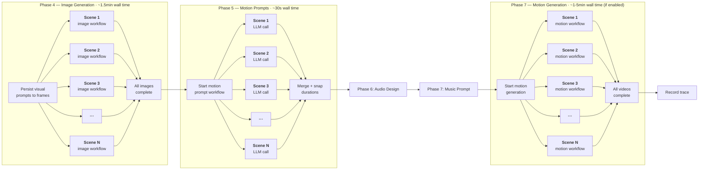
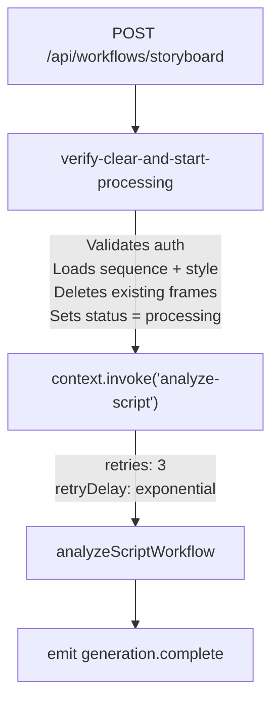
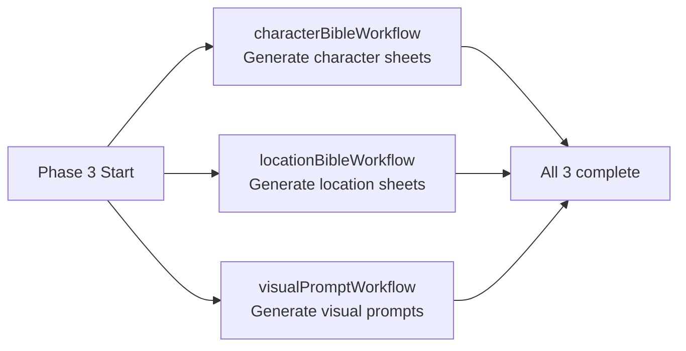
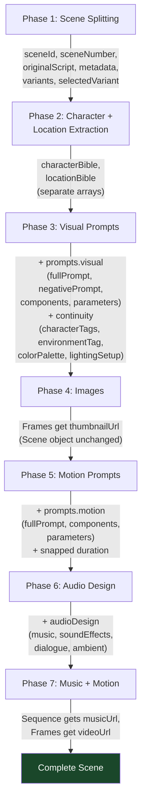

# Analyze Script Workflow

End-to-end pipeline that transforms a user's script into a complete storyboard with images, motion video, and music.

## High-Level Overview

```mermaid
flowchart TD
    Verify["<b>Verify + Prepare</b> · &lt;1s<br/>IN: sequenceId, userId, teamId<br/>OUT: script, aspectRatio, styleConfig,<br/>analysisModelId, imageModel, videoModel"] --> SceneSplit

    subgraph "Phase 1 — Script Analysis · ~3min"
        SceneSplit["<b>Scene Splitting</b> · LLM · ~3min<br/>IN: script, aspectRatio<br/>OUT: scenes[], title"]
        CreateFrames["<b>Create Frames</b> · DB · ~1s<br/>IN: scenes[], sequenceId<br/>OUT: frameMapping[sceneId→frameId]"]
        SceneSplit --> CreateFrames
    end

    subgraph "Phase 2 — Extraction (sequential) · ~2.5min"
        CharExtract["<b>Character Extraction</b> · LLM · ~1min<br/>IN: scenes[]<br/>OUT: characterBible[]"]
        LocExtract["<b>Location Extraction</b> · LLM · ~1.5min<br/>IN: scenes[]<br/>OUT: locationBible[]"]
        CharExtract --> LocExtract
    end

    CreateFrames --> CharExtract

    subgraph "Phase 2b — Matching (sequential, conditional) · &lt;1s if skipped"
        TalentMatch["<b>Talent Matching</b> · LLM<br/>IN: characterBible[], talentList[] (from DB)<br/>OUT: talentCharacterMatches[]<br/><i>skipped if no suggestedTalentIds</i>"]
        LocMatch["<b>Location Matching</b> · LLM<br/>IN: locationBible[], libraryLocationList[] (from DB)<br/>OUT: libraryLocationMatches[]<br/><i>skipped if no suggestedLocationIds</i>"]
        TalentMatch --> LocMatch
    end

    LocExtract --> TalentMatch

    subgraph "Phase 3 — Reference Generation (parallel) · ~1min"
        CharSheets["<b>Character Sheets</b> · image gen ×N chars<br/>IN: characterBible[], talentCharacterMatches[]<br/>OUT: charactersWithSheets[]<br/>(sheetImageUrl per character)"]
        LocSheets["<b>Location Sheets</b> · image gen ×N locs<br/>IN: locationBible[], libraryLocationMatches[]<br/>OUT: locationsWithSheets[]<br/>(referenceImageUrl per location)"]
        VisualPrompts["<b>Visual Prompts</b> · LLM ×N scenes<br/>IN: scenes[], characterBible[], locationBible[],<br/>styleConfig, aspectRatio, analysisModelId<br/>OUT: scenesWithVisualPrompts[]<br/>(fullPrompt, negativePrompt, continuity per scene)"]
    end

    LocMatch --> CharSheets
    LocMatch --> LocSheets
    LocMatch --> VisualPrompts

    subgraph "Phase 4 — Image Generation · ~1.5min"
        PersistVisual["<b>Persist Visual Prompts</b> · DB<br/>IN: scenesWithVisualPrompts[], frameMapping<br/>OUT: frames updated with prompts + continuity"]
        ImageGen["<b>Image Generation</b> · Fal.ai ×N scenes parallel<br/>IN: fullPrompt, imageModel, imageSize,<br/>characterRefs[], locationRefs[] per scene<br/>OUT: imageUrls[] (thumbnailUrl per frame)"]
        PersistVisual --> ImageGen
    end

    CharSheets -->|"charactersWithSheets"| ImageGen
    LocSheets -->|"locationsWithSheets"| ImageGen
    VisualPrompts -->|"scenesWithVisualPrompts"| PersistVisual

    subgraph "Phase 5 — Motion Prompts · ~30s"
        MotionPrompts["<b>Motion Prompt Generation</b> · LLM ×N scenes parallel<br/>IN: scenes[], aspectRatio, characterBible[], styleConfig<br/>OUT: motionPrompt per scene"]
        MergeMotion["<b>Merge + Persist</b> · DB<br/>IN: scenesWithVisualPrompts[], motionPrompts[],<br/>videoModel capabilities<br/>OUT: scenesWithMotionPrompts[]<br/>(snapped durationSeconds per scene)"]
        MotionPrompts --> MergeMotion
    end

    ImageGen --> MotionPrompts
    VisualPrompts -->|"scenes"| MotionPrompts

    subgraph "Phase 6 — Audio Design · ~6min ⚠️"
        AudioDesign["<b>Audio Design</b> · LLM · ~6min<br/>IN: scenesWithMotionPrompts[]<br/>OUT: audioDesign per scene<br/>(music, soundEffects, dialogue, ambient)"]
        MergeAudio["<b>Merge + Persist</b> · DB<br/>IN: scenesWithMotionPrompts[], audioDesign[]<br/>OUT: completeScenes[]"]
        AudioDesign --> MergeAudio
    end

    MergeMotion -->|"scenesWithMotionPrompts"| AudioDesign

    subgraph "Phase 7 — Final Generation (parallel) · ~10s without motion/music"
        MusicPrompt["<b>Music Prompt</b> · LLM · ~10s<br/>IN: scene summaries (title, storyBeat,<br/>durationSeconds, musicStyle, musicMood, musicPresence)<br/>OUT: prompt string, tags string"]
        MotionGen["<b>Motion Generation</b> · Fal.ai ×N parallel · ~1-5min<br/>IN: imageUrls[], motionPrompts[],<br/>videoModel, aspectRatio, durationSeconds<br/>OUT: videoUrl per frame<br/><i>only if autoGenerateMotion</i>"]
        MusicGen["<b>Music Generation</b> · Fal.ai · ~30-120s<br/>IN: prompt, tags, totalDuration, musicModel<br/>OUT: musicUrl on sequence<br/><i>only if autoGenerateMusic</i>"]
        MusicPrompt --> MotionGen
        MusicPrompt --> MusicGen
    end

    MergeAudio -->|"completeScenes"| MusicPrompt
    ImageGen -->|"imageUrls"| MotionGen
    MergeMotion -->|"motionPrompts + durations"| MotionGen

    MotionGen --> Trace
    MusicGen --> Trace
    Trace["<b>Record Trace</b> · &lt;1s<br/>IN: script, styleConfig, completeScenes[]<br/>OUT: Langfuse trace + generation.complete"]

    style Verify fill:#2d2d44,color:#fff
    style Trace fill:#1a472a,color:#fff
```

> **Timing source:** Measured from local QStash logs for a 9-scene run (`wfr_analyze-script-01KKGWTGRGQRTN55B3SSH2V89H`), no talent/location matching. Total wall time: **~15 min**. Audio design was the dominant step at ~6 min. Motion and music generation were not triggered in this run (autoGenerate off).

### Per-Scene Fan-Out Detail

Image generation, motion prompts, and motion generation each fan out to parallel sub-workflows per scene, then join before the next phase. Each sub-workflow is an independent QStash invocation with its own retries.

## Triggering Flow

The pipeline starts from server handlers in `src/functions/sequences.ts`:

1. **`createSequenceFn`** -- Creates a new sequence record, then calls `triggerWorkflow('/storyboard', input)` via QStash
2. **`updateSequenceFn`** -- If script, style, aspect ratio, or analysis model changed, triggers the same workflow
3. **`retryStoryboardFn`** -- Retries a failed sequence (resets status to `processing`, re-triggers)

All three use `triggerWorkflow()` from `src/lib/workflow/client.ts`, which:

- Resolves the webhook URL (rewrites localhost to `host.docker.internal` for local dev)
- Calls `WorkflowClient.trigger()` with the URL `{baseUrl}/api/workflows/storyboard`
- Returns a `workflowRunId` for tracking

**Input shape (`StoryboardWorkflowInput`):**

| Field                  | Type      | Purpose                                      |
| ---------------------- | --------- | -------------------------------------------- |
| `userId`               | string    | Auth context                                 |
| `teamId`               | string    | Auth context                                 |
| `sequenceId`           | string    | Target sequence                              |
| `options`              | object    | `framesPerScene`, `generateThumbnails`, etc. |
| `autoGenerateMotion`   | boolean   | Whether to generate video for each frame     |
| `autoGenerateMusic`    | boolean   | Whether to generate music for the sequence   |
| `musicModel`           | string?   | Override music model                         |
| `suggestedTalentIds`   | string[]? | Pre-selected talent for casting              |
| `suggestedLocationIds` | string[]? | Pre-selected locations for matching          |

## Storyboard Workflow

**File:** `src/lib/workflows/storyboard-workflow.ts`

The storyboard workflow is a thin wrapper that validates data and delegates to the analyze-script workflow.

**Step: `verify-clear-and-start-processing`**

1. Validates auth via `validateSequenceAuth()`
2. Loads sequence with `getSequenceForUser()` -- checks script and style exist
3. Loads and parses the style config
4. Deletes all existing frames for the sequence
5. Sets sequence status to `processing`
6. Returns resolved models: `analysisModelId`, `imageModel`, `videoModel`

Then invokes `analyzeScriptWorkflow` with retries (3 attempts, exponential backoff).

After the analyze-script workflow completes, emits `generation.complete`.

## Analyze Script Workflow -- Phase-by-Phase

**File:** `src/lib/workflows/analyze-script-workflow.ts`

This is the core orchestration workflow. It uses `durableLLMCall()` for all LLM interactions and `context.invoke()` for sub-workflows.

### Phase 1: Scene Splitting (LLM)

**Step:** `durableLLMCall('scene-splitting')`

- **Prompt:** `phase/scene-splitting-chat`
- **Variables:** `{ aspectRatio, script }` (script is sanitized)
- **Response schema:** `sceneSplittingResultSchema`
- **Output:** `{ scenes: Scene[], projectMetadata: { title } }`

Splits the user's script into individual scenes. Each scene gets a `sceneId`, `sceneNumber`, metadata (title, duration, location, time of day, story beat), and the original script extract.

### Phase 1b: Create Frames in DB

**Step:** `update-title-and-create-frames`

1. Emits `generation.scene:new` for each scene (progressive display in UI)
2. Updates the sequence title from `projectMetadata.title`
3. Emits `generation.updated` with the new title
4. Bulk-inserts frames into the database:
   - Each frame maps 1:1 to a scene
   - `metadata` field stores the full `Scene` object
   - `thumbnailStatus` = `'generating'`
   - `videoStatus` = `'generating'` if `autoGenerateMotion`, else `'pending'`
5. Sets sequence status to `completed` (frames are visible, generation continues)
6. Emits `generation.frame:created` for each frame

**Output:** `frameMapping` -- array of `{ sceneId, frameId }` used throughout remaining phases.

### Phase 2: Character + Location Extraction (LLM)

Two sequential LLM calls:

**Character extraction:**

- **Step:** `durableLLMCall('character-extraction')`
- **Prompt:** `phase/character-extraction-chat`
- **Variables:** `{ scenes }` (JSON-serialized)
- **Output:** `{ characterBible }` -- array of characters with physical descriptions, clothing, consistency tags

**Location extraction:**

- **Step:** `durableLLMCall('location-extraction')`
- **Prompt:** `phase/location-extraction-chat`
- **Variables:** `{ scenes }` (JSON-serialized)
- **Output:** `{ locationBible }` -- array of locations with descriptions, architecture, color palettes

### Phase 2b: Talent + Location Matching (Conditional LLM)

Only runs if `suggestedTalentIds` or `suggestedLocationIds` were provided.

**Talent matching:**

1. **Step:** `get-talent-list` -- Loads talent records from DB by IDs
2. **Step:** `durableLLMCall('talent-matching')` -- LLM matches characters to talent
3. **Step:** `build-matches` -- Deduplicates matches (each talent/character used once), emits `generation.talent:matched`

**Location matching:**

1. **Step:** `get-library-locations` -- Loads library locations from DB by IDs
2. **Step:** `durableLLMCall('location-matching')` -- LLM matches locations to library entries (requires confidence >= 0.5)
3. **Step:** `build-location-matches` -- Deduplicates matches, emits `generation.location:matched`

### Phase 3: Character Sheets + Location Sheets + Visual Prompts (Parallel Sub-Workflows)

Three sub-workflows invoked in parallel via `Promise.all([context.invoke(...)])`:

**Character Bible Workflow** (`src/lib/workflows/character-bible-workflow.ts`):

- Generates a reference sheet image for each character (parallel per character)
- Uses talent match images as reference when available
- Uploads sheets to R2 storage
- Creates `sequence_characters` DB records
- Emits `generation.phase:start` (phase 3) and `generation.phase:complete`

**Location Bible Workflow** (`src/lib/workflows/location-bible-workflow.ts`):

- Inserts location records into DB from location bible
- Generates establishing-shot reference images for each location (parallel)
- Uses library location reference images when matched
- Uploads to R2 storage, updates DB
- Emits `generation.phase:start` (phase 4) and `generation.phase:complete`

**Visual Prompt Workflow** (`src/lib/workflows/visual-prompt-workflow.ts`):

- Delegates to `visualPromptSceneWorkflow` per scene (parallel via `context.invoke`)
- Each scene gets an LLM call that generates a `fullPrompt`, `negativePrompt`, and `continuity` data (character tags, environment tag, color palette, lighting)
- Merges results back into scene objects

### Phase 4: Persist Visual Prompts + Image Generation

**Step:** `update-frames-after-visual-prompts`

- Writes visual prompts and continuity data to frame records in DB
- Emits `generation.frame:updated` with `updateType: 'visual-prompt'` for each frame

**Image generation** (parallel per scene):

- Records analysis duration on the sequence
- Emits `generation.phase:start` (phase 5, "Generating images...")
- Builds per-scene character and location reference maps (for consistency)
- Invokes `generateImageWorkflow` per scene in parallel:
  - Each gets the visual prompt, image model, image size, and reference images
  - Retries: 3 attempts with exponential backoff
  - Flow control via `getFalFlowControl()`
- Emits `generation.phase:complete` (phase 5)

**Image Workflow** (`src/lib/workflows/image-workflow.ts`):

1. Sets frame `thumbnailStatus` to `'generating'`, emits `generation.image:progress`
2. Calls `generateImageWithProvider()` (Fal.ai)
3. Deducts credits
4. Uploads image to R2 storage
5. Updates frame with `thumbnailUrl`, sets `thumbnailStatus` to `'completed'`
6. Emits `generation.image:progress` with `status: 'completed'`

### Phase 5: Motion Prompt Generation

**Sub-workflow:** `motionPromptWorkflow` (`src/lib/workflows/motion-prompt-workflow.ts`)

- Delegates to `motionPromptSceneWorkflow` per scene (parallel via `context.invoke`)
- Each scene gets an LLM call generating camera movement, motion style, and timing

**Step:** `merge-motion-prompts`

- Merges motion prompts into scene objects
- Snaps duration to video model capabilities

**Step:** `update-frames-after-motion-prompts`

- Writes motion prompts and snapped durations to frame records
- Emits `generation.frame:updated` with `updateType: 'motion-prompt'`

### Phase 6: Audio Design (LLM)

**Step:** `durableLLMCall('audio-design')`

- **Prompt:** `phase/audio-design-chat`
- **Variables:** `{ scenes }` (JSON-serialized scenes with motion prompts)
- **Output:** `{ scenes: [...] }` -- each scene enriched with `audioDesign` (music, sound effects, dialogue, ambient)

**Step:** `merge-audio-design`

- Merges `audioDesign` into scene objects

**Step:** `update-frames-after-audio-design`

- Writes complete scene data to frame records
- Emits `generation.frame:updated` with `updateType: 'audio-design'`

### Phase 7: Music Prompt + Motion + Music Generation

Only runs for scenes where `audioDesign.music.presence !== 'none'`.

**Music prompt generation:**

- Emits `generation.phase:start` (phase 8, "Composing music...")
- `durableLLMCall('music-prompt-generation')` -- generates a music prompt and tags
- Tags are reinforced with instrumental markers
- Music prompt and tags stored on the sequence record

**Motion generation** (conditional -- if `autoGenerateMotion` && `videoModel` && images exist):

- Emits `generation.phase:start` (phase 7, "Generating motion...")
- Invokes `generateMotionWorkflow` per scene in parallel
- Each motion workflow submits a job, polls for completion (batched polling, 30s batches, up to 15 min timeout)
- Uploads video to R2, updates frame, emits `generation.video:progress`
- After all frames complete, auto-triggers `merge-video` workflow

**Music generation** (conditional -- if `autoGenerateMusic`):

- Invokes `generateMusicWorkflow` with the generated prompt, tags, and total duration
- Music workflow generates audio via Fal.ai, uploads to R2, updates sequence record
- After completion, checks if merged video is also ready and triggers `merge-audio-video` if so

### Final: Record Trace + Return

**Step:** `record-workflow-trace`

- Records a trace to Langfuse for observability (input script, style config, aspect ratio, complete scenes, timing)

Returns the `completeScenes` array.

## Data Flow: Scene Object Accumulation

Each phase enriches the `Scene` object. The frame's `metadata` column is updated after phases 3, 5, and 6 to persist intermediate results.

## Real-Time Events

Events emitted via Upstash Realtime on a per-sequence channel (`getGenerationChannel(sequenceId)`).

| Event                                 | When Emitted                                     | Payload                                                               |
| ------------------------------------- | ------------------------------------------------ | --------------------------------------------------------------------- |
| `generation.phase:start`              | Before each LLM call or generation phase         | `{ phase, phaseName }`                                                |
| `generation.phase:complete`           | After each phase completes                       | `{ phase }`                                                           |
| `generation.scene:new`                | Phase 1b -- for each scene as it's created       | `{ sceneId, sceneNumber, title, scriptExtract, durationSeconds }`     |
| `generation.updated`                  | Phase 1b -- after title update                   | `{ title }`                                                           |
| `generation.frame:created`            | Phase 1b -- after frames inserted in DB          | `{ frameId, sceneId, orderIndex }`                                    |
| `generation.frame:updated`            | Phases 4, 5, 6 -- after prompts written to DB    | `{ frameId, updateType, metadata }`                                   |
| `generation.talent:matched`           | Phase 2b -- when talent matched to characters    | `{ matches: [{ characterId, characterName, talentId, talentName }] }` |
| `generation.location:matched`         | Phase 2b -- when locations matched to library    | `{ matches: [{ locationId, locationName, libraryLocationId, ... }] }` |
| `generation.image:progress`           | Image workflow -- generating/completed/failed    | `{ frameId, status, thumbnailUrl? }`                                  |
| `generation.video:progress`           | Motion workflow -- generating/completed/failed   | `{ frameId, status, videoUrl? }`                                      |
| `generation.audio:progress`           | Music workflow -- generating/completed/failed    | `{ status, audioUrl? }`                                               |
| `generation.character-sheet:progress` | Character bible -- per character                 | `{ characterId, status, sheetImageUrl? }`                             |
| `generation.location-sheet:progress`  | Location bible -- per location                   | `{ locationId, status, referenceImageUrl? }`                          |
| `generation.failed`                   | On workflow failure                              | `{ message }`                                                         |
| `generation.complete`                 | Storyboard workflow -- after everything finishes | `{ sequenceId }`                                                      |

## Error Handling

### Failure Function

The analyze-script workflow registers a `failureFunction` that:

1. Sanitizes the error via `sanitizeFailResponse()` (strips internal details)
2. Updates sequence status to `'failed'` with the error message
3. Emits `generation.failed` with the sanitized error

Sub-workflows (image, motion, music, character bible, location bible) each have their own failure functions that update the relevant record's status to `'failed'`.

### Retry Strategy

| Level                              | Retries           | Backoff                            |
| ---------------------------------- | ----------------- | ---------------------------------- |
| Storyboard invoking analyze-script | 3                 | Exponential (`2^retried * 1000ms`) |
| Image generation per scene         | 3                 | Exponential                        |
| Motion generation per scene        | 3                 | Exponential                        |
| Music generation                   | 3                 | Exponential                        |
| Individual `context.run()` steps   | Managed by QStash | Automatic                          |

### QStash Durability

- Each `context.run()` step is checkpointed -- if the server restarts mid-workflow, execution resumes from the last completed step
- `context.invoke()` creates a child workflow that runs independently with its own retries
- Motion polling uses batched polling (30s tight loops with checkpoints between batches) to reduce QStash step count by ~10x

## Key Files Reference

| File                                                | Purpose                                         |
| --------------------------------------------------- | ----------------------------------------------- |
| `src/functions/sequences.ts`                        | Server functions that trigger the pipeline      |
| `src/lib/workflow/client.ts`                        | `triggerWorkflow()` -- QStash integration       |
| `src/routes/api/workflows/$.ts`                     | Workflow route registration (`serveMany`)       |
| `src/lib/workflows/storyboard-workflow.ts`          | Wrapper: verify, clear, invoke analyze-script   |
| `src/lib/workflows/analyze-script-workflow.ts`      | Core 8-phase orchestration                      |
| `src/lib/workflows/llm-call-helper.ts`              | `durableLLMCall()` -- 3-step LLM pattern        |
| `src/lib/workflows/visual-prompt-workflow.ts`       | Visual prompt sub-workflow (parallel per scene) |
| `src/lib/workflows/visual-prompt-scene-workflow.ts` | Per-scene visual prompt LLM call                |
| `src/lib/workflows/motion-prompt-workflow.ts`       | Motion prompt sub-workflow (parallel per scene) |
| `src/lib/workflows/motion-prompt-scene-workflow.ts` | Per-scene motion prompt LLM call                |
| `src/lib/workflows/character-bible-workflow.ts`     | Character sheet generation                      |
| `src/lib/workflows/location-bible-workflow.ts`      | Location sheet generation                       |
| `src/lib/workflows/image-workflow.ts`               | Image generation (Fal.ai)                       |
| `src/lib/workflows/motion-workflow.ts`              | Motion/video generation (Fal.ai)                |
| `src/lib/workflows/music-workflow.ts`               | Music generation (Fal.ai)                       |
| `src/lib/realtime/index.ts`                         | Real-time event schema and channel helpers      |
| `src/lib/ai/scene-analysis.schema.ts`               | `Scene` type definition                         |
| `src/lib/workflows/music-prompt.schema.ts`          | Music prompt Zod schema                         |
